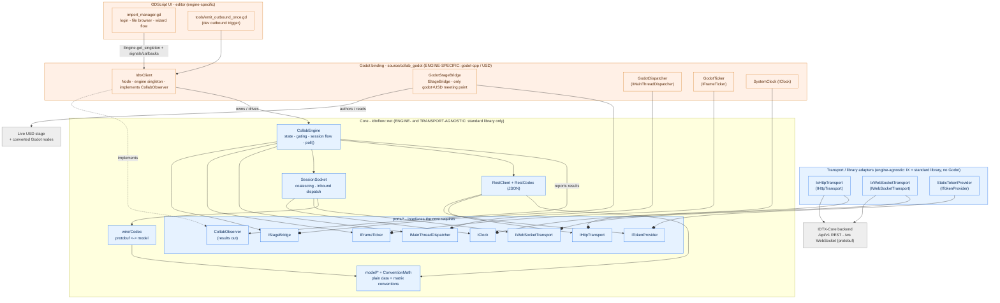

# IDTXFlow Collaboration Client

## 1. What this is

The IDTX collaboration client is the Godot-editor-side half of a real-time collaborative USD
editing system. It lets an operator log into an **IDTX-Core** backend, browse and import a
`.usda` stage into the Godot editor, open a live **session**, and have local transform edits
**broadcast** to peers while **inbound** peer edits apply into the editor — all over a REST +
WebSocket (protobuf) contract.

It is built as a **hexagonal (ports & adapters) architecture**: a pure, standard-library-only
**core** (`idtxflow::net`) that knows nothing about Godot, the WebSocket library (IXWebSocket),
protobuf-on-the-wire, or OpenUSD, surrounded by thin **adapters** and a single **Godot binding**.

## 2. Layered component map

```
+----------------------------------------------------------------------------+
|  GDScript UI  (addons/IDTXFlow/import_manager/*.gd)                         |  editor UX
|   import_manager.gd . server_login_panel.gd . server_file_provider.gd .     |
|   idtx_client_access.gd (singleton lookup) . tools/emit_outbound_once.gd    |
+-------------------------------+--------------------------------------------+
                                | Engine.get_singleton("IdtxClient"):
                                | methods + signals + completion callbacks
+-------------------------------v--------------------------------------------+
|  GODOT BINDING  (source/collab_godot/*)  -- the ONLY engine-specific part   |
|   IdtxClient (Node, singleton, implements the observer interface)           |
|   GodotStageBridge (the ONLY place Godot and OpenUSD types meet)            |
|   GodotDispatcher (main-thread marshaller) . GodotTicker (per-frame source) |
|   SystemClock . IxHttpTransport . IxWebSocketTransport . StaticTokenProvider|
+-------------------------------+--------------------------------------------+
                                | ports injected down ^ results reported up (main thread)
+-------------------------------v--------------------------------------------+
|  CORE  (shared/.../idtxflow/net/*)  -- STANDARD LIBRARY ONLY                |
|   CollabEngine      orchestrator: state, gating, session flow, poll()       |
|   RestClient        REST orchestration (4 endpoints) + RestCodec (JSON)     |
|   SessionSocket     WS protocol: coalescing + inbound dispatch + Codec      |
|   wire/Codec        protobuf <-> model (the only protobuf-on-wire code)     |
|   model/*           plain data types + matrix-convention math               |
|   ports/*           the 7 interfaces the core requires (below)              |
+----------------------------------------------------------------------------+
                                | (talks to)
              IDTX-Core backend (separate service): /api/v1 REST + /ws WebSocket
```

The same overview as a diagram, with the three tiers colored — engine- & transport-agnostic
(core + the IX/standard-library adapters), engine-specific (the Godot binding and UI), and external:



Reading the diagram: blue = engine- and transport-agnostic (the core plus the IX/standard-library
adapters, which name no Godot types); orange = engine-specific (the Godot binding, its Godot/USD
adapters, and the editor UI); grey = external (the backend and the live USD stage). A `--o` edge
means "provides/implements this port"; a plain arrow means "uses / depends on". Every adapter plugs
into a core port, and all background results flow back up through `CollabObserver` on the main
thread.

**The hard rule:** nothing in the core (`idtxflow::net`) names a Godot, WebSocket-library, or
OpenUSD type — the only exception is the JSON parser, which is confined to one REST-decoding file.
Godot and OpenUSD types meet in exactly one place: the stage bridge in the binding. This is what
keeps the core reusable across engines and testable without any of them.

## 3. The core (`idtxflow::net`)

- **`CollabEngine`** — the orchestrator and single owner of session state. It holds the injected
  ports and one observer, owns `RestClient` + `SessionSocket`, and owns the **broadcast-gating
  flags**:
  - `remote_` — is this a collaborative session that should broadcast at all?
  - `armed_` — has the freshly-loaded stage settled, so edits are real user edits (not the many
    transform writes made while converting the stage)?
  - `applying_remote_` — is an inbound peer edit currently being applied? (used to suppress echoing
    it straight back to the sender)

  It also owns the high-level session lifecycle (`begin_session`/`end_session`), the active session
  id/mode, and `poll()` (drains outbound edits and advances the "arming" countdown).

- **`RestClient`** — REST orchestration specific to the four IDTX endpoints: `POST /auth/login`,
  `GET /files`, `POST /sessions`, `DELETE /sessions/<id>`. It attaches the bearer token, applies
  protocol rules (a `401` on any call clears the stored token; a `DELETE` returning `2xx` or `404`
  both count as "gone"), and delivers typed results via callbacks. All JSON parsing is isolated in
  **`RestCodec`**; `RestClient` itself never touches JSON. The JSON parser it uses today is OpenUSD's
  built-in JSON (`pxr::Js`), chosen only because OpenUSD is already linked, so it adds no extra
  dependency. Because all JSON handling stays inside this one decoding file (and never appears in any
  header or in the core), the parser can be swapped for another JSON library without touching the
  REST client, the engine, or any caller.

- **`SessionSocket`** — the session protocol over the WebSocket port. **Inbound:** decode each
  binary frame and dispatch to a callback (handshake / remote-edit / ack / error / disconnect).
  **Outbound:** **per-prim coalescing** — it keeps a `prim_path -> latest edit` map and sends at
  most **one frame per prim per `poll()`**, so a burst of rapid edits (a gizmo drag) collapses into
  a single network update.

- **`wire/Codec`** — the only code that speaks protobuf on the wire; it translates the generated
  message to and from the plain `model` types. The generated protobuf types never leak past this
  boundary.

- **`model/*`** — plain data: a row-major 4x4 matrix, a separate translation/rotation/scale form, a
  single-prim edit, a file-list entry, session info, login result, error, health result; a
  disconnect-reason enum; and the **matrix-convention math** — the single place that converts
  between the wire's row-major layout and USD's basis layout (with translation on the matrix's
  bottom row).

**Why headers + `.cpp` (not header-only).** The split is deliberate and dependency-driven, not a
blanket style:

- **Header-only** where a module is *pure* — the seven port interfaces, the plain data types, the
  disconnect/state enums, the small inline matrix-convention math, the observer interface, and the
  trivial token/fetch adapters. These carry no non-trivial logic and no heavy dependency to hide,
  so they need no `.cpp`.
- **Header + `.cpp`** where a module has real compiled logic **or a heavy/leaky dependency that must
  be confined** — the engine, the REST client, the session socket, the protobuf wire codec, the JSON
  REST decoder, and the IX-based transports. The heavy dependency (the generated protobuf code, the
  JSON parser, the WebSocket library) lives *only* in the `.cpp`, so the matching header stays
  dependency-light.

This keeps public headers cheap to include, stops the heavy libraries from leaking into the core's
compile surface, and preserves the rule that the core names no engine, WebSocket-library, or OpenUSD
types. A header-only design would instead pull those includes into every translation unit that
touches the core, inflating build times and breaking that isolation.

## 4. The seven ports (the seams — this is where the system is extended)

Each port is an interface the core *requires*; the binding provides a concrete implementation
(adapter). The core depends only on the interfaces.

The concrete transports today are built on the IXWebSocket library (its WebSocket for the session
socket and its HTTP client for REST). That is an implementation choice behind the transport ports:
because the core only knows the `IHttpTransport` / `IWebSocketTransport` interfaces, IXWebSocket can
be replaced with a different HTTP or WebSocket library by writing new adapters, without any change to
the core, the REST client, the session socket, or the protocol.

| Port | What the core needs | Adapter that provides it |
|---|---|---|
| HTTP transport | issue HTTP requests (method/path/body/headers -> status/body/headers), sync + async | over the IX HTTP client + a small bounded thread pool |
| WebSocket transport | send/receive binary frames, observe connect state, set upgrade headers | over the IX WebSocket |
| Token provider | read/set/clear the current bearer token | a process-wide, thread-safe holder (one token) |
| Main-thread dispatcher | marshal a background result back onto the engine's main thread | Godot `call_deferred`-based drain |
| Frame ticker | run `poll()` once per frame | wired to Godot's per-frame signal |
| Clock | monotonic milliseconds to timestamp edits | the system clock |
| Stage bridge | author/apply/read prim transforms and report stage changes | the Godot+USD bridge |

## 5. The Godot binding (`source/collab_godot/*`)

- **`IdtxClient`** — a Godot `Node` registered as the global engine singleton `"IdtxClient"` at
  module load, then started immediately, so scripts and editor tools reach it by that name. It is
  created **outside the scene tree**, so its per-frame `poll()` is driven by wiring to Godot's
  per-frame signal (via a small deferred, self-retrying connect that waits until the scene tree
  exists). It constructs the concrete adapters, owns the `CollabEngine`, and is the observer: it
  converts each core result into a **Godot signal** and, for requests, into a **per-request
  completion callback** (a small result dictionary: `{ ok, result }` on success, or
  `{ ok:false, http_code, error_code, message }` on failure). It converts between the core's plain
  types and Godot Variants (including `Transform3D` <-> the wire matrix via the convention math).

- **`GodotStageBridge`** — the single place Godot and OpenUSD types coexist. It authors edits onto
  USD prims (the "free local save"), applies inbound edits with **loopback suppression** (a flag set
  while it authors programmatically, so the resulting change notice isn't re-broadcast), reads prim
  transforms, and reports genuine stage changes back to the core through a USD change-notice
  listener so the core can gate and coalesce them.

- **USD nodes** (`source/nodes/*`): a stage node that loads/converts/configures the imported USD,
  plus converted prim nodes (xform, mesh, multi-mesh, skeleton, static-body) sharing a common mixin.
  A local move on a prim node reaches the client through Godot's transform-changed notification.

## 6. GDScript UI (`addons/IDTXFlow/import_manager/*.gd`)

The Import Manager wizard drives everything through the singleton: a stateless lookup helper
resolves the singleton; a login panel authenticates; a file-provider lists server files; the main
manager orchestrates create -> ready -> stage-load and prints the new session id plus a
ready-to-run "watch this session" command. A dev-only script can trigger one outbound move for
testing, since converted prims aren't exposed in the scene tree to gizmo-drag directly.

## 7. End-to-end workflows

- **Login:** `login()` -> REST `POST /auth/login` on a worker thread -> JSON decoded -> marshalled
  to the main thread -> token stored -> result reported as a signal + completion callback.
- **List files:** same shape -> the file decoder normalizes paths and best-effort-decodes the
  "modified" timestamp.
- **Server import (the main flow):** `begin_session()` in the core (1) creates the session,
  (2) computes the authenticated stage download URL and the WebSocket URL, (3) opens the session
  socket (bearer sent on the upgrade), (4) reports "session ready" with the stage URL; the binding
  then loads the USD stage from that URL and attaches it back for collaboration.
- **Outbound edit:** a prim moves -> the client authors it into the live stage (local save) -> the
  stage's change notice fires -> the core **gates** it (broadcast only if remote + armed + not
  currently applying a remote edit) -> the socket **coalesces** it -> the next `poll()` encodes and
  sends one frame -> the server broadcasts to peers.
- **Inbound edit:** a peer's frame arrives -> decoded -> marshalled to the main thread -> the core
  marks "applying remote", applies it into USD with broadcast suppression (so it isn't echoed), then
  clears the flag -> the prim moves in the editor.
- **Arming:** right after a stage loads, conversion writes many transforms; broadcasting those would
  be wrong, so a short frame countdown runs in `poll()` and only then enables broadcasting.
- **Teardown:** `end_session()` detaches the stage, closes the socket, and requests deletion on the
  backend.
- **Threading:** HTTP runs on a bounded thread pool; the WebSocket runs on its own thread; **every
  result crosses back to the main thread through the dispatcher** before any observer or Godot call.
  `poll()` and all callbacks are main-thread.

## 8. How to extend the system

- **Add a REST endpoint:** add the result type (plain data), add a parser in the REST codec (JSON
  stays there), add a method on `RestClient` that builds the request and routes the response,
  surface it on the engine + observer, then expose it on the binding as a method + signal/callback.
  No transport change — the HTTP port is method/URL-agnostic. Cover it with a fake-HTTP unit test.

- **Add a WebSocket / protobuf message:** add the message to the `.proto` definition (the build
  regenerates the protobuf code); handle it in the wire codec (inbound decode and/or outbound
  encode, keeping the generated types confined to that one file); add a callback in the session
  socket and dispatch the new kind on receipt (coalesce it if it's high-frequency per-prim); surface
  it on the engine + observer; expose it on the binding as a signal/Variant. Cover it with a codec
  round-trip test and a fake-WebSocket dispatch test.

- **Add a new transport backend** (e.g. a non-IX HTTP or WebSocket library): implement the HTTP or
  WebSocket port as a new adapter and wire it in during the binding's initialize step. The core is
  untouched.

- **Add a new engine binding** (e.g. a non-Godot host): implement the seven ports and the observer
  interface for that engine, then reuse the entire core unchanged. Nothing in `idtxflow::net` needs
  to change.

The through-line: **new behavior is added by extending a port or a codec, not by editing the
transport or the engine.**

## 9. Build & tests

- **Build:** SCons. The core and the binding compile into the single GDExtension library that Godot
  loads. The protobuf-on-wire code plus the generated message code are the only protobuf translation
  units; the WebSocket and OpenUSD libraries are already linked. A normal build produces and
  installs the library under the addon's binary folder.
- **Tests:** organized under one top-level `tests/` tree:
  - a C++ unit suite (`tests/unit/...`), built and run with a single command, that exercises REST
    parsing, session flow, the codec, and coalescing **entirely with fakes** — a fake HTTP
    transport, a fake WebSocket, an inline dispatcher, and a fake token provider — so it needs **no
    server, no engine, and no network**;
  - a Python "second client" harness (`tests/e2e/`) that speaks the same REST + WebSocket protocol as
    a peer, used to verify the live end-to-end path (it is client-only and requires a **running
    backend**).
- **Quality gate:** an automated check confirms the core contains no engine, WebSocket-library, or
  OpenUSD types (the JSON parser confined to the REST decoder is the only allowed exception), and
  that the unit suite passes with fakes only.

## 10. Limitations (current)

- **Single-session client.** The binding holds one socket, one stage, and one active session id;
  opening a second session **silently replaces** the first. The transport model is **one WebSocket
  per session**. The backend supports many concurrent sessions; the client, today, follows exactly
  one at a time.
- **Single-editor mode only.** A session created in "single-edit" mode allows exactly one live
  WebSocket client; a second connection is rejected. A debug flag can switch new imports to a
  collaborative mode for multi-client testing.
- **One process-wide token.** The token holder stores a single bearer, set on login and cleared on a
  `401`. There is no per-server / multi-credential support and no token refresh — an expired token
  simply fails the next call and the user logs in again.
- **Transform-sync coverage gap.** Only the xform and mesh prim nodes forward their transform edits
  into collaboration. The multi-mesh, skeleton, and static-body prim nodes are movable but **do not
  sync** (they lack the forwarding hook). Moving them is harmless but is silently not collaborated.
- **Server file browser sort/filter is effectively a no-op** for the flat server listing, and the
  server's "modified" value is implementation-defined
- **A separate HTTP path exists in the wider codebase** (a REST-driven datasource node that uses the
  WebSocket library's HTTP client directly, with per-prim endpoints and per-prim authorization). It
  has not been converged onto the core's HTTP port.
- **The HTTP port assumes a single base URL and shared timeouts** — correct for the one IDTX
  backend, but not yet generalized for arbitrary multi-host use.
- **Connection lifecycle is editor-UI-driven; no auto-connect or reconnect.** Login and the
  session/WebSocket connection are established only through explicit actions in the editor's Import
  Manager wizard (connect and log in, then import a stage). Nothing connects automatically at
  startup, on scene load, or at game runtime, and there is no reconnect: if the socket drops or the
  scene/editor is reopened, the disconnect is reported (as a signal) but the session is not
  re-established — the operator repeats the wizard flow. Session state is in-memory only and does not
  persist across a reopen. (The underlying WebSocket library supports automatic reconnection, but the
  client does not enable it.) A related editor affordance shows the same limitation: the Inspector's
  "Connect" button on a `UsdStageNode3D`'s `stage_uri` is intended to reload/retry the current URI,
  but it is currently a no-op because the stage node ignores a set to an unchanged value — so
  reloading with the same URI does nothing.

## 11. Next steps / planned follow-ups

1. **Multi-session support** — replace the binding's single-session scalars with a session map so
   the client can hold several sessions/stages/sockets at once.
2. **Converge the separate HTTP path onto the core's HTTP port** — generalize that port (per-call
   absolute URL, per-request timeouts and TLS) so both the collaboration REST client and the
   datasource node share one transport foundation, while the datasource keeps its own per-prim
   authorization.
3. **Optional token bootstrap** — at startup, read a token from the environment (e.g. an environment
   variable or a project setting) into the token holder and skip login when one is already
   provisioned; fall back to the normal login flow otherwise. A keyed multi-credential store remains
   a possible later addition, not built yet.
4. **Close the transform-sync coverage gap** — share the transform-forwarding hook across all
   movable prim node types (so skeleton/static-body/multi-mesh also collaborate their moves). This
   is a deliberate behavior change and needs live validation before enabling.
5. **Server browser sort/filter and a portable "modified" timestamp** — small client-side and
   backend-side fixes so listings sort correctly and timestamps are unambiguous.
6. **Decouple the connection and reload lifecycle from the editor UI** — add a programmatic
   connect/login path (usable outside the wizard, including at game runtime), automatic reconnect on
   drop, and session resume across a scene/editor reopen; and expose an explicit stage-reload action
   on `UsdStageNode3D` (so the Inspector's "Connect" button can force a reload with the same URI) — so
   collaboration and stage reload no longer depend on manually repeating the wizard flow or editing a
   value to re-trigger it.

## Summary

The IDTX collaboration client is a **hexagonal (ports & adapters) system**: a standard-library-only
core (`idtxflow::net`) owns all protocol, session state, and broadcast-gating logic behind seven
interfaces, while the WebSocket library, OpenUSD, protobuf, and Godot are confined to the edges as
adapters, with a single Godot binding (`IdtxClient` plus the stage bridge) as the only
engine-specific part. The end-to-end flow is **login → browse → server-import (create session, open
socket, load stage) → bidirectional transform sync (outbound gated and coalesced; inbound
loopback-suppressed) → teardown**. Extension is localized: a **new REST endpoint** touches the codec,
client, engine, observer, and binding; a **new WebSocket/protobuf message** touches the protocol
definition, codec, socket, engine, observer, and binding; a **new transport or engine** only requires
implementing the interfaces. The current implementation is **single-session, single-editor, and
single-token**, with the connection lifecycle driven by the editor UI and a few known sync and UX
gaps — all recorded as deferred work — while the core architecture and the end-to-end flow are
complete and in place.

