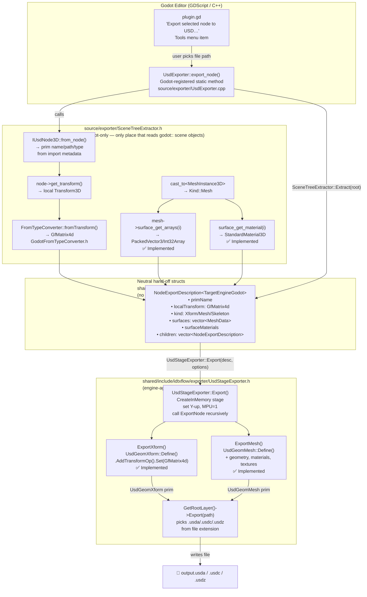

# USD Exporter — Status & Data Flow

> Quick-reference for humans and AI sessions picking up the work — update this file after every
> session. Architecture/patterns reference: [EXPORTER_DESIGN.md](EXPORTER_DESIGN.md).
> Geometry/material export, and overlay export, are **done and validated** by a real Godot scene
> round-tripped through usdView. See "Next steps" below for what's left — it's an unordered list of
> independent next steps now, not a strict phase sequence; pick whichever the user asks for.

---

## What has been built — geometry + materials round-trip in usdView, plus overlay export

The full call path from Godot editor button → USD file on disk is wired up and working.
A USD `.usda`/`.usdc`/`.usdz` file is produced with the complete **node hierarchy**, **transforms**,
**mesh geometry** (points/normals/UVs/vertex colors, multi-surface via `UsdGeomSubset`) and
**materials** (`UsdPreviewSurface` + textures written next to the stage). Verified by round-tripping
a real Godot scene through usdView.

| File | What it does | State |
|------|-------------|-------|
| `addons/IDTXFlow/plugin.gd` | Adds "Export selected node to USD…" to the Godot Tools menu; opens a save-file dialog (pre-filled name, auto-appends `.usda` if the typed extension isn't recognized); calls `UsdExporter.export_node()` | ✅ Done |
| `source/exporter/UsdExporter.{h,cpp}` | Godot-registered class with a static `export_node(root, uri, options)` method callable from GDScript | ✅ Done |
| `source/exporter/SceneTreeExtractor.h` | Walks the `Node3D` subtree; classifies each node (Xform/Mesh/Skeleton); reads local transforms, mesh surfaces, and materials (`GeometryInstance3D::material_override` → per-surface override → mesh's own material, in that priority) | ✅ Done |
| `shared/include/idtxflow/exporter/ExportDescription.h` | Neutral hand-off structs (`NodeExportDescription`, `MaterialExportDescription`, `TextureExportRef`, `StageExportOptions`) — no Godot types | ✅ Done |
| `shared/include/idtxflow/exporter/UsdStageExporter.h` | Engine-agnostic stage authoring: creates in-memory stage, recurses, authors `UsdGeomXform`/`UsdGeomMesh` (incl. `leftHanded` orientation — see fixes below) + `UsdShadeMaterial`. `Export()` falls back to `stage->Export(path)` when the plain layer export fails (needed for `.usdz` packaging). | ✅ Xform + Mesh + Material done |
| `shared/include/idtxflow/exporter/FromTypeConverter.h` | Inverse leaf-conversion declarations (`fromTransform`, `fromVector3`, `fromColor`) | ✅ Done |
| `shared/include/idtxflow_godot/exporter/GodotFromTypeConverter.h` | Godot specializations of `FromTypeConverter` | ✅ Done — round-trip validated |
| `source/register_types.cpp` | `GDREGISTER_CLASS(UsdExporter)` | ✅ Done |

### Bugfixes found via real usdView QA

- **Black/backface meshes in usdView** — USD defaults to `rightHanded` winding, Godot/the importer use `leftHanded`; `ExportMesh` now calls `mesh.CreateOrientationAttr(UsdGeomTokens->leftHanded)` explicitly.
- **`material_override` ignored** — `SceneTreeExtractor` now checks `GeometryInstance3D::get_material_override()` first, then per-surface override, then the mesh resource's own material (matches Godot's actual render priority).
- **`.usdz` export failed** — `SdfLayer::Export()` can't package an anonymous in-memory layer; `UsdStageExporter::Export()` now falls back to the flattening `UsdStage::Export()` path.
- **Save dialog UX** — filename pre-filled from the export root's node name; typed names missing a recognized USD extension get `.usda` appended automatically.
- **Inside-out mesh on re-import** — the *importer's* `UsdMeshConverter::BuildMesh` unconditionally reversed triangle winding (assuming every source mesh is `rightHanded`), ignoring the mesh's actual `orientation` attribute — it was read into a member variable but never consulted. Meshes explicitly authored `leftHanded` (i.e. our own exporter's output, re-imported) got double-flipped and rendered inside-out. Fixed: the reversal is now conditional on `orientation` (default corrected to the true USD default, `rightHanded`, too — it was wrongly defaulting to `leftHanded`, previously harmless dead code).
- **`overlay_new_only` always failed with "no import ancestry"** — `UsdStageNode3D` never set its own `IUsdNode3D::stage_path` (only prims converted *from* it did, via `ConvertPrimPostProcess`); selecting the stage node itself as the export root and walking *up* the tree never found a set path. Fixed: `UsdStageNode3D::_convert_stage()`/`_load_converted_stage()` now call `set_stage_path(...)` on themselves too.

---

## Next steps (no fixed priority — pick whichever is requested; independent of each other)

- **Broaden USD export coverage** — animations (`UsdSkelAnimation`), skeletons/skinning
  (`Skeleton3D` bones + `ARRAY_BONES`/`ARRAY_WEIGHTS` → `UsdSkel`, mirroring `SkeletonConverter`;
  accept the existing ≤4-influence clamp as lossy/one-way), instancing
  (`UsdMultiMeshInstanceNode3D` → `PointInstancer`), variant sets. Files: `SceneTreeExtractor.h`,
  `UsdStageExporter.h`.
- **Support our custom prims** (collision, interaction, …) — export `IDTXCollisionAPI` /
  `IDTXInteractionAPI` back onto their prims (mirror the import side); re-emit native primitive
  prims (Cube/Sphere/Cone as their real USD Gprim type instead of a triangulated mesh, using
  `originalPrimType`); an `IPrimExporter<TargetEngineGodot>` registry mirroring `IPrimConverter` for
  extension-authored node types (reuse the `IDTXFLOW_GODOT_API` + `extern template` DLL-singleton
  pattern, see `source/converter/PrimConverterRegistryGodot.cpp`). Files: mostly new.
- **Anchor nodes** — see design sketch below.
- **Generic "what changed" export detection** — see design sketch below; would generalize/replace
  `OverlayPositionChanged`.

### Preserving original USD data (overlay export)

**Implemented**, in two layers. `IUsdNode3D::get_stage_path()` (the original stage's resolved file
path — now set both on converted prims *and* on the `UsdStageNode3D` itself, see bugfixes above)
and `NodeExportDescription::originalPrimPath` (captured per node by `SceneTreeExtractor`) are the
two pieces of existing metadata this reuses — no new extraction code was needed.

1. `UsdExporter::export_node` resolves the original stage path by walking from `root` up through
   parents looking for the nearest `IUsdNode3D`; errors out if an overlay mode is requested and no
   ancestor (including `root` itself) has import metadata.
2. `UsdStageExporter::Export`, in either overlay mode, calls
   `stage->GetRootLayer()->InsertSubLayerPath(...)` with a path relative to the output file's
   directory (`ComputeRelativeSubLayerPath`, falls back to an absolute path e.g. across Windows
   drives) instead of authoring fresh up-axis/metersPerUnit metadata. `OverlayPositionChanged`
   additionally opens the original stage a second time, read-only, purely for comparison
   (`originalStage`).
3. `ExportNode` decides per node whether to reuse the sub-layer's existing prim or (re-)author one:
   - No `originalPrimPath` → new node, always authored (both overlay modes).
   - Has `originalPrimPath`, mode `OverlayNewOnly` → never re-authored, its path is reused directly
     as-is for recursion (already exists via the sub-layer).
   - Has `originalPrimPath`, mode `OverlayPositionChanged` → `HasTransformChanged` compares the
     node's current local transform against `UsdGeomXformable::GetLocalTransformation()` read from
     `originalStage` (row-by-row, `1e-5` epsilon); if different, it's re-authored (an `over` on top
     of the sub-layer, at its *original* path, not a new sibling); if unchanged, reused untouched.
   `UsdStage::DefinePrim` auto-creates missing ancestor `over` specs, so nesting a new prim under a
   sub-layer-only path needs no extra code.
4. `plugin.gd`'s save dialog has an "Export mode" dropdown (`FileDialog::add_option` with 3 values)
   mapping to `options.overlay_mode` = `""` / `"new_only"` / `"position_changed"`.

**Known limitations** (by design, not a bug):
- `OverlayPositionChanged` only detects **transform** changes (hence the name — it was originally
  called `OverlayChanged`, renamed to be honest about its narrow scope). Editing a mesh's geometry,
  vertex colors, or material on an already-imported node in Godot is *not* detected — that node is
  still treated as unchanged and skipped. If that matters for a given edit, re-export as `Flatten`
  instead. **Its long-term value is uncertain** — it's a cheap heuristic for the common
  "moved an existing part" case, but the "Generic 'what changed' export detection" idea below would
  supersede it with something that actually covers mesh/material edits too; keep, extend, or drop
  `OverlayPositionChanged` once that's built.
- No deletion support: removing a node from the Godot scene doesn't remove/deactivate its prim in
  the original stage — the overlay is purely additive/corrective, never subtractive.
- OpenUSD has no built-in "diff two arbitrary states" API for this use case (session
  layers/`PcpLayerStack` are for live interactive editing on an open stage, not comparing an
  external engine's re-extracted scene against a prior snapshot) — `HasTransformChanged` is a
  hand-rolled comparison against attribute values read back from the original stage. See the
  "Generic 'what changed' export detection" design sketch below for a fuller approach.

### Anchor nodes (design sketch — requested, not started)

A new lightweight Godot node (e.g. `UsdAnchorNode3D : Node3D`, mixing in `IUsdNode3D` like the
other node types) that the user places/positions/names in the editor, with a couple of exported
properties (`anchor_type: String`, and either a free-form `tag: String` or a `Dictionary` of
key/value metadata). It carries no mesh — just a transform and identity/metadata.

Export mirrors the collision/interaction API pattern already used for `IDTXCollisionAPI`: define a
new applied API schema (e.g. `idtx:AnchorAPI` under `usd/`, generated the same way as
`collisionAPI`/`interactionAPI`) with attributes like `idtx:anchor:type` and `idtx:anchor:tag`,
applied to a plain `UsdGeomXform` prim authored at the node's transform. `SceneTreeExtractor` gets a
new `Kind::Anchor` case that reads those two properties into a small neutral
`AnchorExportDescription`; `UsdStageExporter` gets an `ExportAnchor` that defines the `Xform`,
applies the schema, and sets the attributes.

Combined with overlay export, exporting a scene where only anchors were added (no other edits) with
`OverlayNewOnly` produces a small `.usda` containing just the new anchor prims, subLayer-referencing
the original stage — i.e. "export only new objects" *is* `OverlayNewOnly` with an anchors-only
scene; no separate mode is needed, though a UI checkbox/tooltip explaining this is worth adding to
`plugin.gd`.

### Generic "what changed" export detection (design sketch — not started)

**Idea:** instead of hand-writing a per-field comparison (what `OverlayPositionChanged` does today,
transform-only), get an apples-to-apples "reference" export by re-running the **original** stage
through our own import → extract pipeline, then compare the resulting neutral descriptions against
the live scene's descriptions field-by-field. Only nodes that differ (or are new) get authored;
matched-and-unchanged nodes are skipped exactly like `OverlayNewOnly` does today. This would
generalize/replace `HasTransformChanged` with a fuller `HasNodeChanged`.

Why round-trip the original through our own pipeline first, instead of diffing directly against the
artist-authored original file: comparing our export against the original's *own* authoring would
produce false positives from formatting/precision/ordering differences that have nothing to do with
real edits. Running the original through the *same* lossy pipeline as the live scene guarantees both
sides were produced by identical code, so any remaining difference is a real content difference.
OpenUSD has no built-in "diff two arbitrary states" API for this — session layers/`PcpLayerStack`
are for live interactive editing on an open stage, not comparing a re-extracted external scene
against a prior snapshot — so this has to be hand-rolled either way.

**Implementation sketch:**
1. Import `originalStagePath` via `UsdStageConverter` as normal, but do **not** add the resulting
   nodes to the live `SceneTree` — just keep the `ConvertedEntities` in memory.
2. Run `SceneTreeExtractor::Extract()` on that temporary hierarchy (same export options as the real
   export) → a "reference" `NodeExportDescription` tree.
3. `memdelete` the temporary nodes immediately — no visible flicker, no scene mutation.
4. Match reference nodes to the live scene's nodes by `originalPrimPath`. For each match, compare
   the whole `NodeExportDescription` (transform, mesh surfaces via `PackedArray` equality, material
   channels) — if anything differs, treat the node as changed and re-author it (same idea as
   `OverlayPositionChanged` does for transforms today); if identical, skip/reuse.
5. Nodes present in the live scene with no match → new, always authored (unchanged from today).

**Must be designed up front — move/delete/rename are NOT solved by this scheme:**
- **Move** (same node, different parent) isn't a transform change — `originalPrimPath` matching is
  by absolute path, so re-parenting produces a "new" node at a different synthesized path *and* an
  unvisited reference node at the old path. Decide: detect this (same mesh/material content,
  different path) and treat it as a move? Or accept the simpler (lossy) delete+add behavior?
- **Rename** (same node/parent, new Godot node name) hits the same path-matching limitation — it
  looks like a new prim even though nothing about the content changed.
- **Delete** (Godot node removed entirely): after matching, any reference node never visited is a
  deletion candidate. USD has no "remove a prim a weaker layer defines" — correct authoring is
  `prim.SetActive(false)` (an `over` with `active = false`) in the overlay layer, not omission. This
  needs an explicit "which reference prims were never visited" pass, and a decision on whether to
  author deactivation automatically or just warn.
- None of this is exotic OpenUSD-wise (`SetActive(false)` is standard), it just needs deliberate
  handling — the naive version of this feature (match-by-path, compare-if-matched,
  author-if-different) silently does the wrong thing for moves/renames/deletes if shipped without it.

**Cost:** requires a real (if temporary, off-tree) **import** of the original stage — heavier than
`OverlayPositionChanged`'s current read-only attribute peek, since it builds real Godot meshes/
materials/textures just to extract and discard them. Only runs once per export click, though.

---

## Data flow diagram

### Lossy inversions applied during mesh/UV export

| Import did this | Export must invert | Location |
|---|---|---|
| `uv.y = -uv.y` (FlipUvV) | write `st.y = -godot_uv.y` | `UsdStageExporter::ExportMesh` |
| Fan-triangulated n-gons | emit `faceVertexCounts` all `3` | `UsdStageExporter::ExportMesh` |
| Bone weights clamped to 4, renormalized | export as-is (unrecoverable) | future skeleton export, see Next steps |
| Up-axis Z→Y + MPU scale at stage root | author Y-up, MPU=1 (no per-node fixup needed) | `UsdStageExporter::Export` |

---

## Key decisions locked in

1. Export **both** native Godot nodes and USD-imported nodes.
2. **Synchronous** export; neutral structs are the thread-safe boundary.
3. Format (`.usda`/`.usdc`/`.usdz`) chosen by file extension — no separate code paths.
4. Textures **always written** to `texture_dir`; relative asset paths in USD.

---

## Next session: where to start

1. **Read** `docs/EXPORTER_DESIGN.md` for the architecture/patterns to mirror.
2. Geometry/materials/overlay export are done; pick whichever "Next steps" item was requested —
   they're independent of each other, no fixed order. See "Next steps" above for the current list
   (broader USD export coverage, custom prims, anchor nodes, generic diff-based export detection).
3. Build after every change: `scons platform=windows target=template_debug -j8`.
