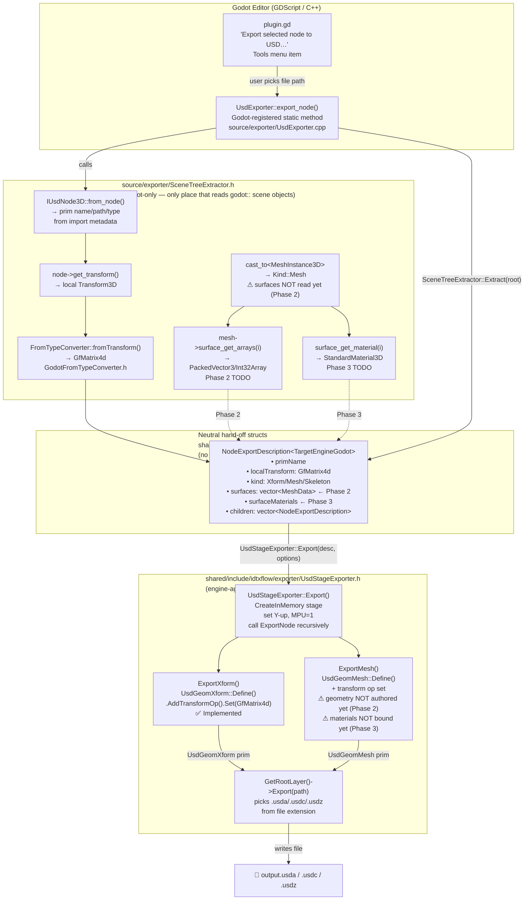

# USD Exporter — Status & Data Flow

> Quick-reference for humans and AI sessions picking up the work.  
> Authoritative implementation spec: [EXPORTER_DESIGN.md](EXPORTER_DESIGN.md).  
> Next session prompt: load the [`usd-exporter` skill](../.github/skills/usd-exporter/SKILL.md),
> read `EXPORTER_DESIGN.md`, then start at **§9 Phase 1 validation** followed by **§6.3 Phase 2**.

---

## What has been built (Phase 0 — compiles & links)

The full call path from Godot editor button → USD file on disk is wired up and working.
A USD `.usda`/`.usdc`/`.usdz` file is produced with the complete **node hierarchy** and **transforms**.
Mesh geometry and materials are **not** written yet (stubs only).

| File | What it does | State |
|------|-------------|-------|
| `addons/IDTXFlow/plugin.gd` | Adds "Export selected node to USD…" to the Godot Tools menu; opens a save-file dialog; calls `UsdExporter.export_node()` | ✅ Done |
| `source/exporter/UsdExporter.{h,cpp}` | Godot-registered class with a static `export_node(root, uri, options)` method callable from GDScript | ✅ Done |
| `source/exporter/SceneTreeExtractor.h` | Walks the `Node3D` subtree; classifies each node (Xform/Mesh/Skeleton); reads local transforms and `IUsdNode3D` metadata for imported nodes | ✅ Done — surfaces/materials **not yet read** |
| `shared/include/idtxflow/exporter/ExportDescription.h` | Neutral hand-off structs (`NodeExportDescription`, `MaterialExportDescription`, `TextureExportRef`, `StageExportOptions`) — no Godot types | ✅ Done |
| `shared/include/idtxflow/exporter/UsdStageExporter.h` | Engine-agnostic stage authoring: creates in-memory stage, recurses, authors `UsdGeomXform` with transform op. Mesh/material methods are stubs. | ✅ Xform done — Mesh/Material **stubs** |
| `shared/include/idtxflow/exporter/FromTypeConverter.h` | Inverse leaf-conversion declarations (`fromTransform`, `fromVector3`, `fromColor`) | ✅ Done |
| `shared/include/idtxflow_godot/exporter/GodotFromTypeConverter.h` | Godot specializations of `FromTypeConverter` | ✅ Done — **round-trip not yet validated** |
| `shared/include/idtxflow/exporter/ExportDescription.h` | neutral structs | ✅ Done |
| `source/register_types.cpp` | `GDREGISTER_CLASS(UsdExporter)` | ✅ Done |

---

## What is missing (in priority order)

| Phase | What | Key files to touch |
|-------|------|--------------------|
| ~~**1 — Transform validation**~~ | ~~Verify `fromTransform` is the exact inverse of `toTransform`. Round-trip a node through export → re-import and confirm `global_transform` matches within epsilon. Fix basis/row convention if needed. Add sibling-name de-dup (`_1`, `_2`) in `SceneTreeExtractor`.~~ **✅ DONE.** Static analysis confirms `toTransform` passes USD row `i` as Basis column `i`; `fromTransform` reads `column(i)` and writes it as row `i` — exact inverse. `SanitizePrimName` applied at extraction time; de-dup loop added before `out.children.push_back`. Compiles & links. | `GodotFromTypeConverter.h`, `SceneTreeExtractor.h` |
| ~~**2 — Mesh geometry**~~ | ~~Read `ArrayMesh` surfaces in `SceneTreeExtractor`; author `points`/`faceVertexCounts`/`faceVertexIndices`/`normals`/`primvars:st` (un-flip V) in `UsdStageExporter::ExportMesh`; create `UsdGeomSubset` per surface.~~ **✅ DONE.** `SceneTreeExtractor` reads all 5 surface arrays (`Vertices/Triangles/Normals/UVs/VertexColors`) with explicit `PackedXxxArray` casts. `ExportMesh` accumulates all surfaces into one `UsdGeomMesh`, authors `points`, `faceVertexIndices`, `faceVertexCounts=3`, `normals` (vertex interp), `primvars:st` (V un-flipped, vertex interp), `primvars:displayColor`. `UsdGeomSubset`s per surface for multi-surface meshes. Compiles & links. | `SceneTreeExtractor.h`, `UsdStageExporter.h` |
| ~~**3 — Materials + textures**~~ | ~~Extract `StandardMaterial3D` channels; author `UsdPreviewSurface` + `UsdUVTexture`; write texture PNG files; bind to mesh/subset.~~ **✅ DONE.** `SceneTreeExtractor::ExtractMaterial` reads albedo/metallic/roughness/specular/emissive/normal/AO with scalar + texture fallback (no `has_feature` — checks value/texture validity). `UsdStageExporter::ExportMaterial` authors the full `UsdPreviewSurface` shader network + `UsdPrimvarReader_float2(st)` + per-channel `UsdUVTexture`; writes PNG bytes to `textureOutputDir`; binds via `UsdShadeMaterialBindingAPI` to mesh or `UsdGeomSubset`. Compiles & links. | `SceneTreeExtractor.h`, `UsdStageExporter.h`, `ExportDescription.h` |
| **4 — Skeletons & skinning** | Read `Skeleton3D` bones + `ARRAY_BONES`/`ARRAY_WEIGHTS`; author `UsdSkel`. | `SceneTreeExtractor.h`, `UsdStageExporter.h` |
| **5 — Extras** | Animation, collider API, re-emit native primitive prims, `IPrimExporter` registry. | New files |

---

## Data flow diagram

### Lossy inversions applied during mesh/UV export (Phase 2+)

| Import did this | Export must invert | Location |
|---|---|---|
| `uv.y = -uv.y` (FlipUvV) | write `st.y = -godot_uv.y` | `UsdStageExporter::ExportMesh` |
| Fan-triangulated n-gons | emit `faceVertexCounts` all `3` | `UsdStageExporter::ExportMesh` |
| Bone weights clamped to 4, renormalized | export as-is (unrecoverable) | Phase 4 |
| Up-axis Z→Y + MPU scale at stage root | author Y-up, MPU=1 (no per-node fixup needed) | `UsdStageExporter::Export` |

---

## Key decisions locked in

1. Export **both** native Godot nodes and USD-imported nodes.
2. **Synchronous** export; neutral structs are the thread-safe boundary.
3. Format (`.usda`/`.usdc`/`.usdz`) chosen by file extension — no separate code paths.
4. Textures **always written** to `texture_dir`; relative asset paths in USD.

---

## Next session: where to start

1. **Load** the `usd-exporter` skill and read `docs/EXPORTER_DESIGN.md`.
2. **Phase 1 validation** (§9): build, import a USD file, export, re-import, confirm transforms match.
   Then add sibling-name de-dup in `SceneTreeExtractor::ExtractRecursive` (§5.1).
3. **Phase 2 mesh** (§5.3 + §6.3): read `ArrayMesh` surfaces in `SceneTreeExtractor`, then fill
   `UsdStageExporter::ExportMesh` with actual geometry authoring.
4. Build after every phase: `scons platform=windows target=template_debug -j8`.
