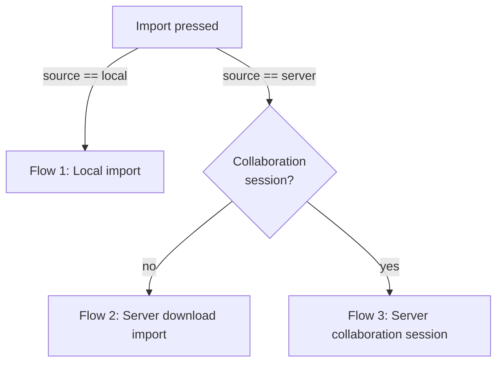
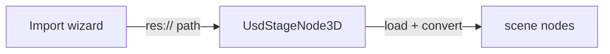
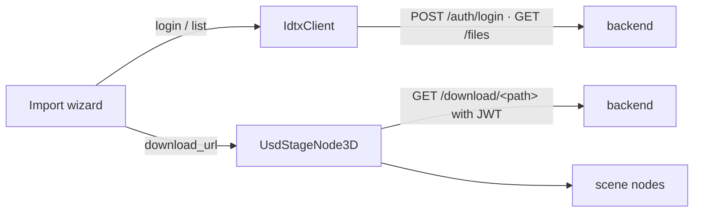
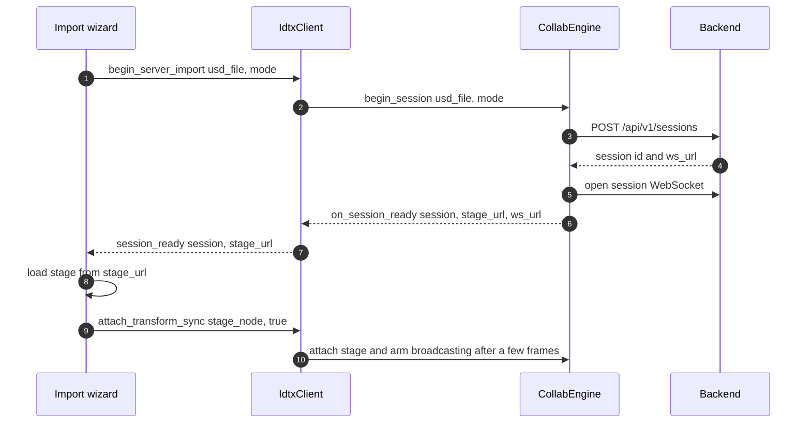

# End-to-End Flows

How a whole import operation runs across the three layers — the editor UI, the
Godot binding, and the net core — down to the IDTX backend. Per-file detail lives
in [import-manager.md](import-manager.md), [godot-binding.md](godot-binding.md),
and [net-core.md](net-core.md); this doc shows how they cooperate.

The wizard's **Import** button dispatches one of three flows. The branch is:

- **Local import** — no backend, no auth, no socket.
- **Server download import** — authenticated download; no session/WebSocket.
- **Server collaboration session** — authenticated download **plus** a live session
  WebSocket and real-time transform sync.

**Destination (all import flows).** Step 3 also chooses where the stage lands:
*current scene* imports it under the selected node (or the scene root), while
*new scene* loads it into a temporary node, packs it into a fresh `res://<name>.tscn`,
and reopens that as its own scene tab with the stage as root. Every flow below
supports both; the branch is `_perform_import_into_current_scene` vs.
`_perform_import_into_new_scene`.

---

## Flow 1 — Local import (`res://`)

Pick a USD file from the project and load it into a scene. Entirely local.

1. Step 1 select **Local**, Step 2 browse `res://`, Step 3 choose destination.
2. **Import** -> `_perform_import()` -> `_perform_local_import(file_path)`.
3. Destination routes to `_perform_import_into_current_scene(file_path)` or
   `_perform_import_into_new_scene(file_path)`.
4. A `UsdStageNode3D` receives the `res://` URI, loads and converts the stage into
   child nodes, and emits `stage_loading_finished`.

No `IdtxClient`, token, or socket is involved.

---

## Flow 2 — Server download import (no collaboration)

Authenticate to a server, browse its files, and import a USD via an authenticated
download — like a local import, but the bytes come from the backend. No session,
no WebSocket.

1. Step 1: enter the server URL, **Connect** (health probe), then log in
   (`IdtxClient.login` -> `POST /api/v1/auth/login` -> the token is stored in the
   shared token provider).
2. Step 2: browse the server (`ServerFileProvider` -> `IdtxClient.list_files` ->
   `GET /api/v1/files`).
3. Step 3: leave *Import as collaboration session* **off**, choose destination,
   **Import** -> `_perform_server_import()` -> `_perform_server_download_import()`.
4. The wizard resolves `IdtxClient.download_url(file_path)` and hands that URL to a
   `UsdStageNode3D` (current or new scene). The stage node fetches it through the
   USD HTTP asset resolver, whose `JwtHttpFetcher` attaches the current token, so
   the authenticated `GET /api/v1/download/<path>` succeeds.

Authenticated, but there is still no session or socket — the loaded stage is a
plain local copy.

---

## Flow 3 — Server collaboration session import

Everything in Flow 2's login/browse, but the import opens a **live session**: a
WebSocket is opened and the loaded stage is wired for real-time transform sync.

1. Step 1-2: same login + server browse as Flow 2.
2. Step 3: turn **Import as collaboration session** on (mode: single or
   collaborative), **Import** -> `_perform_server_import()` ->
   `_perform_server_session_import()`.
3. The wizard connects the `session_ready` signal and calls
   `IdtxClient.begin_server_import(usd_file, mode)`. The engine then runs the whole
   sequence: `POST /api/v1/sessions` -> resolve the authenticated `stage_url` and
   the full `ws_url` -> open the session WebSocket -> report `on_session_ready`.
4. On `session_ready`, the wizard loads the stage from the resolved `stage_url`
   (same download-URL mechanism as Flow 2), then calls
   `attach_transform_sync(stage_node, true)`. The engine attaches the stage bridge
   and arms broadcasting a few frames later.
5. Transform sync is now live — see
   [transform-sync-flow.md](transform-sync-flow.md) for the inbound/outbound edit
   path.

Both destinations are supported: the current-scene path attaches sync to the
freshly loaded stage node; the new-scene path packs and reopens the stage as its
own scene, then re-attaches sync to the reopened stage node.

---

## Supporting flows

These operations run before/around an import and are shared by the server flows.

**Login / Connect.** Step 1's *Connect* first probes reachability
(`IdtxClient.health` -> `GET /api/v1/health`); logging in calls
`IdtxClient.login` -> `POST /api/v1/auth/login`, and the returned JWT is stored in
the shared token provider. Because REST, the session WebSocket upgrade, and the
USD asset resolver all read the token at use time, a login (or logout) is seen
everywhere without reconfiguring them.

**Browse files.** The server browser's `ServerFileProvider` calls
`IdtxClient.list_files` -> `GET /api/v1/files`. The backend returns one flat,
recursive listing of every USD file (each with `filepath` + `directory`); the
provider synthesizes a browsable directory tree from that single response and
caches it, reloading when the server URL changes.

**Thumbnail + cache.** Thumbnails are requested in two places (server browser only —
the local provider has none). While the file list is populated, the
`WizardFileBrowser` requests a thumbnail **per file row** (in thumbnail display
mode); selecting a file also shows a larger preview in `AssetDetailPanel`. Both go
through `ServerFileProvider` -> `IdtxClient.fetch_thumbnail` ->
`GET /api/v1/thumbnail/<path>`. Two cache layers keep this cheap: the browser keeps
a decoded-texture cache keyed by `usd_file` (so re-listing or re-showing reuses it),
and the core caches the raw bytes by `usd_file` (so the selection preview reuses
what listing already fetched). Failures (including a 404 when no thumbnail has been
generated yet) are not cached, so a later retry can pick one up once the backend
produces it.

---

## Session lifecycle

A collaboration session is created by `begin_server_import` and **owned by the
engine**, not the wizard (the wizard tracks no session state). It is torn down by
`IdtxClient.end_session()` -> `CollabEngine::end_session()`, which detaches the
stage, closes the socket, and requests backend deletion, then reports
`session_closed`.

The wizard calls `end_session()` from `_teardown_active_session()` on **Cancel**
and on **plugin/scene exit**, so a session is not leaked on the backend. Socket
resilience (TLS, keepalive, reconnect) is handled inside the WebSocket transport
(see [godot-binding.md](godot-binding.md) / [net-core.md](net-core.md)).

---

## Where each flow touches the code

| Flow | UI | Binding | Core / backend |
|---|---|---|---|
| Local | `_perform_local_import`, `UsdStageNode3D` | — | — |
| Server download | login/browse steps, `_perform_server_download_import` | `IdtxClient.login/list_files/download_url`, JWT asset resolver | `POST /auth/login`, `GET /files`, `GET /download/<path>` |
| Collaboration | `_perform_server_session_import`, `_on_session_ready` | `IdtxClient.begin_server_import`, `StageBridge` | `CollabEngine.begin_session`, `POST /sessions`, `/ws`, transform sync |

