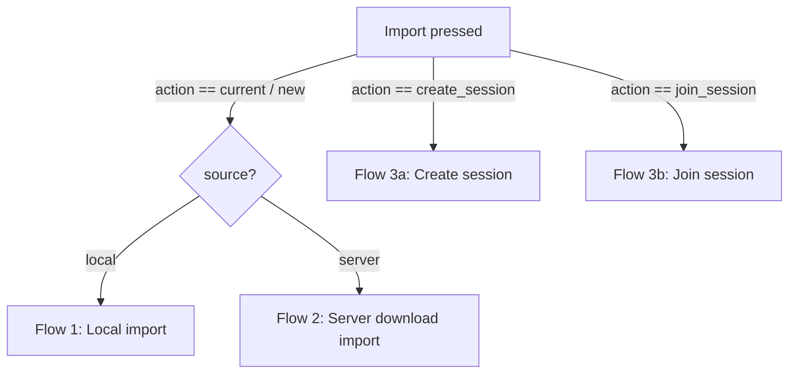
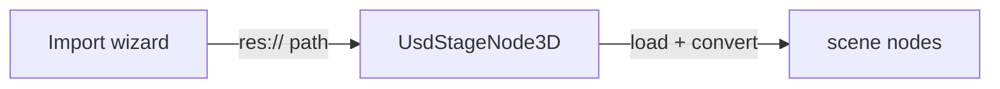
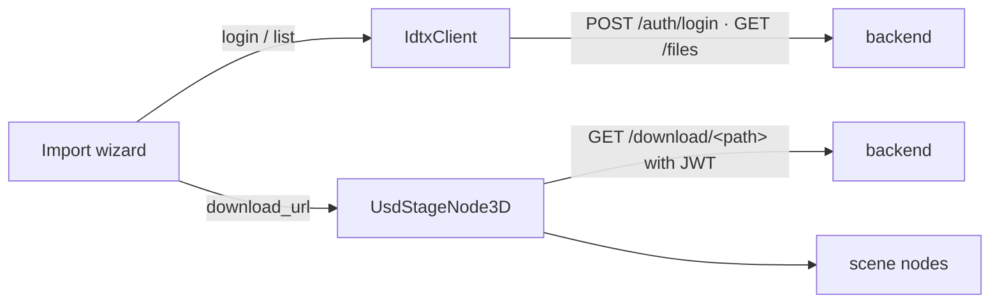
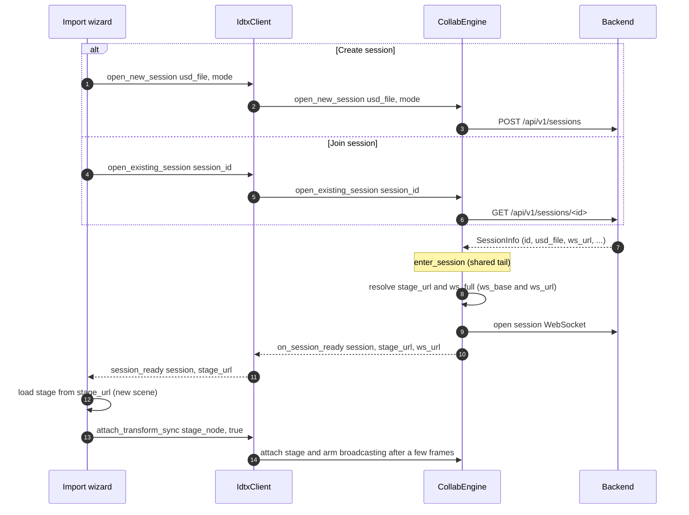

# End-to-End Flows

How a whole import operation runs across the three layers — the editor UI, the
Godot binding, and the net core — down to the IDTX backend. Per-file detail lives
in [import-manager.md](import-manager.md), [godot-binding.md](godot-binding.md),
and [net-core.md](net-core.md); this doc shows how they cooperate.

The wizard's **Import** button dispatches a flow based on the **import mode**:

The four import-mode options are:

1. **Import into current scene** — download only (no session), into the current scene.
2. **Import into new scene** — download only (no session), into a fresh scene.
3. **Create collaboration session** — create + open a live session (mode: single_edit
   / collaborative_edit); always a new scene.
4. **Join collaboration session** — join a running `collaborative_edit` session for the
   selected file; always a new scene.

- **Local import** (option 1/2, local source) — no backend, no auth, no socket.
- **Server download import** (option 1/2, server source) — authenticated download; no
  session/WebSocket.
- **Create / Join session** (option 3/4, server only) — authenticated download **plus** a
  live session WebSocket and real-time transform sync.

**Destination.** Options 1/2 honor their selection; the session options
(3/4) always import into a new scene. *current scene* imports the stage under the
selected node (or the scene root), while *new scene* loads it into a temporary node,
packs it into a fresh `res://<name>.tscn`, and reopens that as its own scene tab with
the stage as root. The branch is `_perform_import_into_current_scene` vs.
`_perform_import_into_new_scene`.

> **How authenticated downloads resolve.** `IdtxClient.download_url(usd_file)` (and the
> core's `RestClient::download_url`) is a **pure string composer** — it returns
> `base_url + /api/v1/download/<usd_file>` and attaches **no** JWT and fetches nothing.
> The actual authenticated fetch happens when a `UsdStageNode3D` is given that
> `http(s)://` URL as its `stage_uri`: OpenUSD routes the URI to the
> **`UsdHttpAssetResolver`** (registered for the `http`/`https` schemes), whose
> `_OpenAsset` downloads it via the **JWT-injecting fetcher** installed at startup
> (`register_types.cpp` → `ConfigureWithFetcher(make_jwt_fetcher(...))`). That fetcher
> reads the shared token **at fetch time** and adds `Authorization: Bearer …` on every
> request (including USD sublayer/reference fetches). So every flow below reuses the same
> mechanism — no per-flow download or auth handling — and the only invariant is that the
> user stays logged in while the stage loads (`end_session()` does not clear credentials).

---

## Flow 1 — Local import (`res://`)

Pick a USD file from the project and load it into a scene. Entirely local.

1. Step 1 select **Local**, Step 2 browse `res://`, Step 3 choose destination.
2. **Import** -> `_perform_import()` -> `_perform_local_import(file_path)`.
3. Destination routes to `_perform_import_into_current_scene(file_path)` or
   `_perform_import_into_new_scene(file_path)`.
4. A `UsdStageNode3D` receives the `res://` URI, loads and converts the stage into
   child nodes, and emits `stage_loading_finished`.

No `IdtxClient`, token, or socket is involved.

---

## Flow 2 — Server download import (no collaboration)

Authenticate to a server, browse its files, and import a USD via an authenticated
download — like a local import, but the bytes come from the backend. No session,
no WebSocket.

1. Step 1: enter the server URL, **Connect** (health probe), then log in
   (`IdtxClient.login` -> `POST /api/v1/auth/login` -> the token is stored in the
   shared token provider).
2. Step 2: browse the server (`ServerFileProvider` -> `IdtxClient.list_files` ->
   `GET /api/v1/files`).
3. Step 3: choose **Import into current scene** or **Import into new scene** (no
   session), **Import** -> `_perform_import()` -> `_perform_server_download_import()`.
4. The wizard resolves `IdtxClient.download_url(file_path)` and hands that URL to a
   `UsdStageNode3D` (current or new scene). The stage node fetches it through the
   USD HTTP asset resolver, whose `JwtHttpFetcher` attaches the current token, so
   the authenticated `GET /api/v1/download/<path>` succeeds.

Authenticated, but there is still no session or socket — the loaded stage is a
plain local copy.

---

## Flow 3 — Server collaboration session (Create or Join)

Everything in Flow 2's login/browse, but the import opens a **live session**: a
WebSocket is opened and the loaded stage is wired for real-time transform sync. Two
entry points share the same tail — they differ only in how the session is obtained:

- **Create** (`create_session`) → `IdtxClient.open_new_session(usd_file, mode)` →
  `CollabEngine::open_new_session` → `POST /api/v1/sessions`.
- **Join** (`join_session`) → `IdtxClient.open_existing_session(session_id)` →
  `CollabEngine::open_existing_session` → `GET /api/v1/sessions/<id>`.

Both then run the shared `CollabEngine::enter_session`: own the session id/mode,
resolve the authenticated `stage_url` + full `ws_url`, open the session WebSocket, and
report `on_session_ready`. On `session_ready` the wizard loads the stage from the
resolved `stage_url` (same download-resolution mechanism as Flow 2) into a **new scene**,
then calls `attach_transform_sync(stage_node, true)`; the engine attaches the stage
bridge and arms broadcasting a few frames later. Transform sync is then live for **both**
flows — see [transform-sync-flow.md](transform-sync-flow.md) for the inbound/outbound
edit path.

### Flow 3a — Create session

1. Step 1-2: same login + server browse as Flow 2.
2. Step 3: select **Create collaboration session** (mode: single_edit or
   collaborative_edit), **Import** -> `_perform_import()` ->
   `_perform_server_session_import()`.
3. The wizard connects the `session_ready` signal and calls
   `IdtxClient.open_new_session(usd_file, mode)` — the engine creates the session
   (`POST /api/v1/sessions`) and runs the shared `enter_session` tail described above.

### Flow 3b — Join session

1. Step 1-2: same login + server browse as Flow 2.
2. Step 3: select **Join collaboration session** and pick a session from the list. **Import** -> `_perform_import()` -> `_perform_server_join_import()`.
3. The wizard connects the `session_ready` signal and calls
   `IdtxClient.open_existing_session(session_id)` — the engine looks the session up
   (`GET /api/v1/sessions/<id>`) and runs the same `enter_session` tail. Unlike Create,
   no `on_session_created` is emitted (nothing was created).

Both flows import into a new scene: the stage is packed and reopened as its own scene,
then sync is (re-)attached to the reopened stage node.

Session imports produce a **transient** scene (not a kept project asset) that is cleaned
up when its tab is closed / the session ends — see
[import-manager.md](import-manager.md#transient-session-scenes) for the storage location
and deletion triggers.

---

## Supporting flows

These operations run before/around an import and are shared by the server flows.

**Login / Connect.** Step 1's *Connect* first probes reachability
(`IdtxClient.health` -> `GET /api/v1/health`); logging in calls
`IdtxClient.login` -> `POST /api/v1/auth/login`, and the returned JWT is stored in
the shared token provider. Because REST, the session WebSocket upgrade, and the
USD asset resolver all read the token at use time, a login (or logout) is seen
everywhere without reconfiguring them.

**Browse files.** The server browser's `ServerFileProvider` calls
`IdtxClient.list_files` -> `GET /api/v1/files`. The backend returns one flat,
recursive listing of every USD file (each with `filepath` + `directory`); the
provider synthesizes a browsable directory tree from that single response and
caches it, reloading when the server URL changes.

**List sessions.** Entering step 3 for a server import, the wizard calls
`IdtxClient.list_sessions()` -> `GET /api/v1/sessions` and filters the result to the
active `collaborative_edit` sessions **for the selected file** to populate the **Join**
option's list. An empty result disables Join with an inline hint; a **Refresh** button
re-queries in place (`refresh_sessions_requested` -> `_refresh_join_sessions()`).

**Thumbnail + cache.** Thumbnails are requested in two places (server browser only —
the local provider has none). While the file list is populated, the
`WizardFileBrowser` requests a thumbnail **per file row** (in thumbnail display
mode); selecting a file also shows a larger preview in `AssetDetailPanel`. Both go
through `ServerFileProvider` -> `IdtxClient.fetch_thumbnail` ->
`GET /api/v1/thumbnail/<path>`. Two cache layers keep this cheap: the browser keeps
a decoded-texture cache keyed by `usd_file` (so re-listing or re-showing reuses it),
and the core caches the raw bytes by `usd_file` (so the selection preview reuses
what listing already fetched). Failures (including a 404 when no thumbnail has been
generated yet) are not cached, so a later retry can pick one up once the backend
produces it.

---

## Session lifecycle

A collaboration session is entered by `open_new_session` (Create) or
`open_existing_session` (Join) and **owned by the engine**, which can hold several
concurrent sessions — each keyed by its id with its own WebSocket + attached stage. The
wizard tracks the transient scene per session id (`_session_scenes`), so **one live-session
scene tab corresponds to one session**.

**Duplicate-join guard.** `open_existing_session` refuses to join a session the engine is
already in, failing fast with `on_request_failed(GetSession, "already_joined")` and no
round-trip. This guard is client-side by necessity: the server keys WebSocket clients by
connection, not client identity, so it currently cannot detect (and would otherwise silently accept,
or mislabel) a same-client re-join. The wizard mirrors this in the UI
(the join list grays out sessions already open) and re-checks before joining.

**Teardown = leave, per session.** `IdtxClient.end_session(session_id)` →
`CollabEngine::end_session(session_id)` detaches that session's stage, closes+drops its
socket, and forgets it, then reports `session_closed`. It does **not** delete the session on
the backend — leaving simply disconnects; the server reaps idle (zero-client) sessions per
its own rules. The wizard leaves **one** session when its scene tab is closed
(`on_session_scene_closed` → `_leave_session(sid)`), and tears down **all** sessions on
**plugin/scene exit** (`_teardown_all_sessions`), so nothing is leaked.
Socket resilience (TLS, keepalive, reconnect) is handled inside the WebSocket transport
(see [godot-binding.md](godot-binding.md) / [net-core.md](net-core.md)).

---

## Where each flow touches the code

| Flow | UI | Binding | Core / backend |
|---|---|---|---|
| Local | `_perform_local_import`, `UsdStageNode3D` | — | — |
| Server download | login/browse steps, `_perform_server_download_import` | `IdtxClient.login/list_files/download_url`, JWT asset resolver | `POST /auth/login`, `GET /files`, `GET /download/<path>` |
| Create session | `_perform_server_session_import`, `_on_session_ready` | `IdtxClient.open_new_session`, `StageBridge` | `CollabEngine.open_new_session` → `enter_session`, `POST /sessions`, `/ws`, transform sync |
| Join session | `_refresh_join_sessions`, `_perform_server_join_import`, `_on_session_ready` | `IdtxClient.list_sessions`, `IdtxClient.open_existing_session`, `StageBridge` | `CollabEngine.open_existing_session` → `enter_session`, `GET /sessions`, `GET /sessions/<id>`, `/ws`, transform sync |

