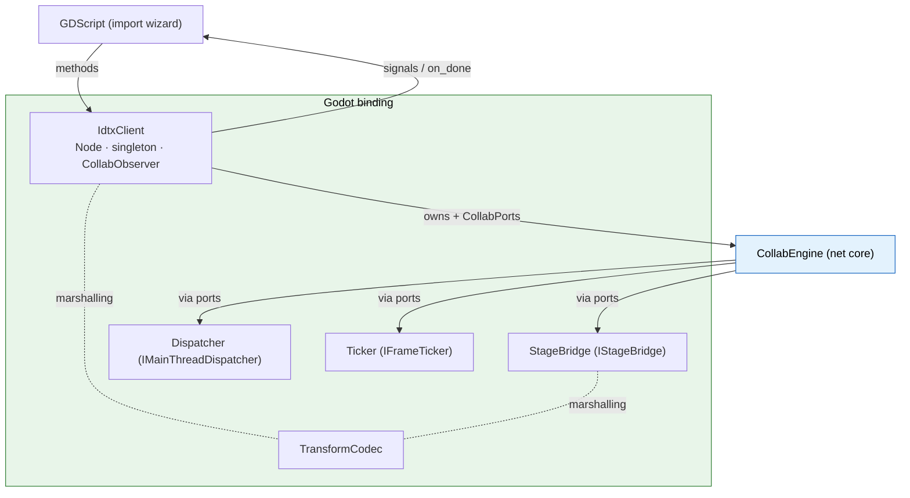

# Godot Binding

The Godot binding is the engine-specific C++ (GDExtension) that connects the
[engine-agnostic net core](net-core.md) to the Godot editor. It is the only place
that names both Godot (`godot::`) and OpenUSD (`pxr::`) types. It implements the
engine-specific ports, converts between Godot and core types, exposes a
GDScript-facing API, and is the composition root that wires everything together.

It lives in:

| Path | Contents |
|---|---|
| `source/collab/` | `IdtxClient`, `StageBridge`, `TransformCodec`, `Dispatcher`, `Ticker` |
| `source/nodes/` | USD node types (`UsdStageNode3D` + converted prim nodes) |
| `source/register_types.cpp` | Module boot: class registration, singleton, composition root |

---

## IdtxClient

A Godot `Node` registered as the global engine singleton `"IdtxClient"`. It
implements `CollabObserver`, owns the `CollabEngine`, and is the composition root.
It contains no networking, protocol, or USD logic — all of that lives behind the
engine and its ports.

**Lifecycle.** The singleton is created and registered from C++ at module init
(before any script runs) and started via `initialize(transport_factory)`. It lives
**outside the scene tree**, so its per-frame `poll()` is driven by wiring to
Godot's per-frame signal through a small deferred, self-retrying connect that waits
until the SceneTree exists. `shutdown()` tears everything down and detaches the
singleton.

**GDScript-facing API.** Reachable as `Engine.get_singleton("IdtxClient")`:

- **Config / auth:** `set_base_url`, `get_base_url`, `is_authenticated`,
  `get_access_token`, `clear_credentials`.
- **REST (async):** `login`, `health`, `fetch_thumbnail`, `list_files`,
  `list_sessions`, `get_session`,
  `commit_session`, `check_download_exists`, `check_thumbnail_exists`. Each
  optionally takes an `on_done` Callable that receives a result Dictionary —
  `{ "ok": true, "result": <payload> }` on success, or
  `{ "ok": false, "http_code", "error_code", "message" }` on failure. `result` is
  an Array of session dicts for `list_sessions`, a session dict for `get_session`,
  `{ session_id, committed }` for `commit_session`, and `{ exists: bool }` for the
  two `check_*_exists` probes (a 404 resolves as `exists: false`, not an error).
- **Session flow (multi-session):** `open_new_session(usd_file, mode, on_done)` (create) and
  `open_existing_session(session_id, on_done)` (join) each run the core's
  obtain → `enter_session` → open-socket → `session_ready` sequence; `end_session(session_id)`
  tears down that one session. The client can hold several concurrent sessions, each keyed by
  its id with its own socket + stage. `open_existing_session` refuses a session already held,
  failing fast with `error_code: "already_joined"` (no round-trip) — the server currently can't detect a
  same-client re-join, so this guard is client-side. The Godot client is
  leave-only: it never creates a bare session or destroys one server-side
  (the backend auto-tears-down a session once its last client leaves), so
  `open_new_session` / `end_session` are the only session-lifecycle entry
  points exposed here. This is distinct from the raw REST calls
  above (which only issues the request).
- **URL helpers:** `download_url`, `ws_base_url`.
- **Session state:** `is_socket_open(session_id)`,
  `send_transform(session_id, prim_path, xform)`. (Socket lifecycle is owned by the engine's
  session flow; there are no separate open/close-socket calls.)
- **Session sync binding (per session):** `bind_session(session_id, stage_node, remote)`,
  `unbind_session(session_id)`, `arm_session(session_id)`,
  `notify_local_transform_changed(session_id, node)`.

**Signals.** `IdtxClient` implements `CollabObserver` and converts each callback
into a Godot signal (and, for a request, into that request's `on_done` dictionary).
Every socket-lifecycle signal carries the `session_id` it belongs to, so a host tracking
multiple concurrent sessions can route each event to the right session/scene:

| Signal | Fired when |
|---|---|
| `session_ready` | session created (`open_new_session`) or joined (`open_existing_session`) + socket opened; carries the resolved stage download URL |
| `session_closed` | `end_session(session_id)` completed (carries `session_id`) |
| `socket_opened` | session WebSocket connected (carries `session_id`) |
| `handshake_received` | server handshake for the session |
| `transform_broadcast_received` | a peer's transform edit arrived (already applied to the stage) |
| `ack_received` | server acknowledged a submitted edit |
| `socket_error` | protocol-level socket error |
| `socket_disconnected` | socket closed/dropped (with reason/code) |

So GDScript never sees a core type: it calls methods, awaits `on_done`
dictionaries, and reacts to signals.

---

## Engine-specific ports (the adapters this binding implements)

These are the ports the net core requires that can only be implemented in terms of
Godot (and, for the stage, OpenUSD). Everything else (transports, token, clock) is
reused from `shared/` — see [net-core.md](net-core.md).

- **`StageBridge`** (`IStageBridge`) — the single place Godot and OpenUSD types
  coexist. It authors edits into the live USD stage (the free local save), applies
  inbound edits with **loopback suppression** (a flag set while it authors, so the
  resulting change notice isn't re-broadcast), reads prim transforms, and reports
  genuine stage changes back to the core through a USD change-notice (`TfNotice`)
  listener. It also handles the spine-axis presentation rotation for Cone/Cylinder
  (see [transform-sync-flow.md](transform-sync-flow.md)).
- **`TransformCodec`** — converts a Godot `Transform3D` to/from the core's
  `PrimEdit`/`Mat4`. Godot-only (no pxr); shared by both `IdtxClient` (outbound
  origin and inbound signal) and `StageBridge` (USD authoring), so the marshalling
  lives in one place. Built on the core's `ConventionMath` for the wire/USD layout.
- **`Dispatcher`** (`IMainThreadDispatcher`) — marshals a background result onto
  the editor main thread via `call_deferred` on the host node; drops posts after
  shutdown so nothing touches a torn-down engine.
- **`Ticker`** (`IFrameTicker`) — drives `poll()` once per frame off
  `SceneTree::process_frame` (which fires in the editor too, unlike `Node::_process`
  for an out-of-tree singleton).

---

## USD nodes (`source/nodes/`)

The imported stage is represented as a tree of Godot `Node3D`s:

- **`UsdStageNode3D`** — loads and converts the USD stage into child nodes and
  emits `stage_loading_finished`. The host attaches transform sync to this node
  after a successful load.
- **Converted prim nodes** — `UsdXFormNode3D`, `UsdMeshInstanceNode3D`,
  `UsdMultiMeshInstanceNode3D`, `UsdSkeletonNode3D`, `UsdStaticBodyNode3D`. They
  share the `IUsdNode3D` mixin (which carries the prim path and a back-pointer to
  the stage node) and are the **outbound origin**: a gizmo move fires
  `NOTIFICATION_TRANSFORM_CHANGED`, which reaches `IdtxClient::notify_local_transform_changed`.

> `UsdRestDatasourceNode3D` and `UsdMockDatasourceFloatNode3D` also live here but
> belong to the separate compute/exec-bridge feature, not the collaboration client.

---

## Module boot & composition root (`register_types.cpp`)

At module init (`MODULE_INITIALIZATION_LEVEL_SCENE`) the extension:

1. Registers the node classes and `IdtxClient` with `ClassDB`.
2. Creates the `IdtxClient`, registers it as the `"IdtxClient"` engine singleton,
   and calls `initialize(std::make_unique<IxTransportFactory>())` — the one place
   that picks the concrete transport library.
3. Configures the **USD HTTP asset resolver** with a `JwtHttpFetcher` (built via
   `make_jwt_fetcher(factory)`) so authenticated `/download/<path>` assets can be
   fetched; the fetcher reads the current token from the shared token provider at
   fetch time.

Teardown (`uninitialize`) shuts the client down and frees it.

---

## How it plugs into the core

`IdtxClient` assembles `CollabPorts` from two sources: the engine-specific ports it
implements here (`StageBridge`, `Dispatcher`, `Ticker`) and the engine-agnostic
ports built by the shared `CollabComposition` helpers (HTTP/WebSocket transports,
token, clock) from the injected `ITransportFactory`. It hands those ports to
`CollabEngine::initialize`, then receives every result back through the
`CollabObserver` interface and converts it to Godot signals / `on_done`
dictionaries. The full "reuse vs. implement" split is in
[net-core.md](net-core.md#portability--what-a-new-host-engine-reuses-vs-implements).

