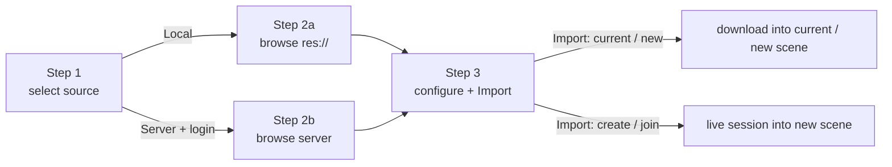

# Import Manager (editor only)

The import manager is the editor-only GDScript UI a user drives to bring a USD file
into the scene. It lives under `addons/IDTXFlow/editor/import_manager/` (plus the plugin
entry in `addons/IDTXFlow/`). It contains no networking itself: it reaches the
native binding only through the `IdtxClient` engine singleton (see
[godot-binding.md](godot-binding.md)).

Two import sources are supported, both driven by the same 3-step wizard:

- **Local (res://)** — pick a USD file from the project and import it. No backend.
- **Asset server** — log in to an IDTX server, browse its files, and import a USD
  via authenticated download; optionally as a live collaboration session (create a
  new session, or join an existing one).

The editor tooling is grouped under `addons/IDTXFlow/editor/`:

| Path | Contents |
|---|---|
| `plugin.gd` | `EditorPlugin` entry: main screen + inspector plugin + settings |
| `editor/import/import_manager.gd` | The wizard root (the active main screen) |
| `editor/import/step_select_source.gd`, `step_configure.gd` | Shared wizard steps (1 and 3) |
| `editor/import/file_provider.gd` | Base browser data-source interface |
| `editor/import/local/` | Local-source step + data provider (`step_browse_files`, `local_file_provider`) |
| `editor/import/server/` | Asset-server step + providers (`step_browse_server`, `server_file_provider`, `server_login_panel`, `server_registry`) |
| `editor/import/widgets/` | Reusable wizard widgets + theme (`wizard_*`, `asset_detail_panel`) |
| `editor/idtx_client_access.gd` | Shared `IdtxClient` singleton lookup (used by import + session_scene) |
| `editor/session_scene/coordinator.gd` | Session coordinator: acquisition (create/join), lifecycle (registry, transient scenes, teardown) |
| `editor/session_scene/indicators.gd` + `tab_marker.gd`, `viewport_overlay.gd` | Live-session visual indicators (`SessionSceneIndicators`, owned by `plugin.gd`; reads the coordinator) |
| `editor/inspector/usd_stage_inspector_plugin.gd` | `UsdStageNode3D.stage_uri` inspector row |

---

## Plugin entry

`plugin.gd` is the `EditorPlugin`. On enter it:

- creates the import-manager main screen and attaches it to the editor's main
  viewport,
- registers the custom Inspector row for `UsdStageNode3D.stage_uri` (the "Connect"
  reload button),
- configures the ProjectSettings used to persist server URLs and usernames,
- forwards the editor's `scene_closed(filepath)` signal to the session-scene
  lifecycle coordinator so closing a session's scene tab is treated as an implicit
  *leave session* (see [Transient session scenes](#transient-session-scenes)),
- prunes any stray transient session scenes left by a prior crash
  (`SessionSceneCoordinator.prune_stale_session_scenes()`).

The active main screen is **`import_manager.gd`** (referenced by `plugin.gd` as its
`MainScreenScript`). The native `IdtxClient` singleton is created and registered
from C++ at module init and its `poll()` is driven by the frame ticker, so no
GDScript autoload hosts it.

---

## The import wizard (`import_manager.gd`)

The wizard is a `PanelContainer` that fills its editor tab. It holds the shared
`_import_state` (source, selected path/metadata, destination, the chosen `action`,
and the active `session_id`), swaps step controls in a step container via
`_show_step(n)`, and owns no session *protocol* state — the collaboration session
lifecycle is owned by the engine. Both the session **acquisition orchestration**
(create/join + the per-request completion/failure handling) and the transient scene *files* are
owned by a dedicated editor coordinator, `editor/session_scene/coordinator.gd`
(created and owned by `plugin.gd`, injected into the wizard via
`set_session_scene_coordinator()`). The wizard *triggers* acquisition
(`create_session` / `join_session`), then materializes the stage when the coordinator
emits `session_stage_ready`, and registers the resulting scene via
`register_session_scene()` (see [Transient session scenes](#transient-session-scenes)).

The three live steps:

- **Step 1 — `step_select_source`** — choose *Import USD from local files* (goes
  straight to the local browser), or enter an *Asset Server* URL and click
  *Connect* to reveal an inline login panel; a successful login advances to the
  server browser.
- **Step 2a — `step_browse_files`** — browse `res://` for USD files. A thin wrapper
  around a `WizardHeader` + a `WizardFileBrowser` driven by a `LocalFileProvider` +
  a `WizardFooter`.
- **Step 2b — `step_browse_server`** — the same layout, but the `WizardFileBrowser`
  is driven by a `ServerFileProvider` that lists the backend's files.
- **Step 3 — `step_configure`** — merged import-options screen: a single 4-way
  **Import mode** radio group plus an asset preview. The **Import** button triggers
  the import. The four modes are:
  1. **Import into current scene** — download only (no session), under the selected
     node / scene root.
  2. **Import into new scene** — download only (no session), into a fresh scene.
  3. **Create collaboration session** — create + open a live session; a mode
     dropdown selects `single_edit` / `collaborative_edit`. Always a new scene.
  4. **Join collaboration session** — join a running `collaborative_edit` session for
     the selected file. Shows a list of active sessions (populated via
     `list_sessions`, with a **Refresh** button and an empty-state hint); **Import**
     stays disabled until a session is selected. Always a new scene.

  Options 3–4 are server-only (hidden for local imports).

---

## Providers (the browser data sources)

`WizardFileBrowser` is source-agnostic: it never touches `DirAccess`/`FileAccess`
or the backend directly. It asks a *provider* to list a directory and renders the
entries. The provider contract is `file_provider.gd`.

- **`LocalFileProvider`** — wraps `DirAccess`/`FileAccess` and mirrors
  `FileDialog`'s access model (`res://` / `user://` / OS filesystem). Listing is
  synchronous.
- **`ServerFileProvider`** — talks to the IDTX backend through the `IdtxClient`
  singleton (`GET /api/v1/files`). The backend returns one **flat, recursive**
  listing of every USD file (each with `filepath` + `directory`); the provider
  synthesizes a browsable directory tree from that single response, caches it, and
  reloads when the server URL changes.

---

## Reusable widgets

- **`WizardFileBrowser`** — an embeddable file browser that ports the *interior* of
  Godot's `FileDialog` into a plain `VBoxContainer` (since `FileDialog` is a
  `Window` and can't be embedded), reusing the editor theme's icons. For
  thumbnail-capable providers it also requests a thumbnail per file row and caches
  the decoded textures.
- **`WizardHeader`** — the progress line ("Step N of M — …") plus a thin progress
  bar.
- **`WizardFooter`** — the button row: `[ Back ] … [ Cancel ] [ Primary ]`.
- **`AssetDetailPanel`** — shows the selected asset's larger thumbnail preview (via
  `IdtxClient.fetch_thumbnail`) and metadata. See [flows.md](flows.md) for the full
  thumbnail request/cache behavior.
- **`wizard_theme`** — a small helper that adapts the wizard to the editor theme
  and UI scale.

---

## Support helpers

- **`ServerRegistry`** — persists known asset servers and the usernames saved for
  each, in ProjectSettings (`idtxflow/import/servers`, `idtxflow/import/last_server`),
  registered by `plugin.gd`.
- **`IdtxAccess`** (`idtx_client_access.gd`) — a stateless lookup for the native
  `IdtxClient` engine singleton, so UI scripts share one call site instead of each
  resolving the singleton themselves. It creates and owns nothing.

---

## UI import flows

Step 3's **Import mode** dispatches one of four actions (`_perform_import()`); the
end-to-end detail (backend calls and transform sync) is in [flows.md](flows.md).

- **Import into current / new scene** — the selected USD is imported into the
  current scene (`_perform_import_into_current_scene`) or a new scene
  (`_perform_import_into_new_scene`). For a local source this is entirely local; for
  a server source it is an authenticated download (no session/WebSocket).
- **Create collaboration session** — the wizard calls
  `SessionSceneCoordinator.create_session(usd_file, mode)`; the coordinator runs
  `IdtxClient.open_new_session` (`POST /sessions`) + the engine open-socket sequence
  and, on the per-request `on_done` completion, emits `session_stage_ready(session_id, stage_url)`. The
  wizard then loads the stage from the resolved URL into a new scene and calls
  `bind_session(session_id, stage_node, true)`.
- **Join collaboration session** — the join list is populated on entering step 3 via
  `IdtxClient.list_sessions()` (filtered to `collaborative_edit` for the selected
  file; re-queryable with **Refresh**). Importing calls
  `SessionSceneCoordinator.join_session(session_id)`, which runs the duplicate-join guard and
  `IdtxClient.open_existing_session` (`GET /sessions/<id>`) + the same open-socket +
  `on_done` → `session_stage_ready` tail as Create. Sessions always import into a new scene.

The session *protocol* lifecycle is owned by the engine (`open_new_session` /
`open_existing_session` / `end_session`). The editor-side **acquisition orchestration**
(create/join, the per-request completion + failure handling, the duplicate-join guard)
is owned by the `SessionSceneCoordinator`, which emits `session_stage_ready` /
`session_failed`. The wizard only triggers acquisition and performs stage
materialization — it tracks no session *protocol* state.

---

## Session-scene coordinator

`editor/session_scene/coordinator.gd` (`SessionSceneCoordinator`) is the editor-tier
hub for live-session scenes. It owns the `session_id → transient-scene-path` registry
(`_session_scenes`), the acquisition orchestration (create/join), and the lifecycle
reactions (close / teardown / startup prune). It *triggers* the runtime client
(`IdtxClient.end_session`) for leave/teardown but is otherwise pure editor bookkeeping.

What it deliberately does **not** own:

- **The visual indicators.** Those are a separate object, `SessionSceneIndicators`
  (`indicators.gd`), owned by `plugin.gd`. The coordinator never touches the viewport,
  tab bar, or any `Control`; it only emits `session_scenes_changed`. `plugin.gd` injects
  the coordinator into the indicators (`setup(editor_interface, coordinator)`) as a
  read-only data source and routes `session_scenes_changed` (and the editor's
  `scene_changed`) to `_indicators.refresh()`. Dependency flows **indicators → coordinator**,
  never the reverse — the coordinator stays visual-free and headless-testable. See
  [Live session indicators](#live-session-indicators).
- **Session *protocol* state.** The socket/session truth lives in the net-core engine
  (`CollabEngine.sessions_`), not here.

**Ownership / wiring.** `plugin.gd` creates the coordinator in `_enter_tree` (plugin-owned,
so it outlives any single wizard interaction) and injects it into the wizard via
`set_session_scene_coordinator()`. The wizard only *triggers* acquisition and materializes
the stage; it holds no session state (see [The import wizard](#the-import-wizard-import_managergd)).

**Public surface (editor-tier):**

| Member | Purpose |
| --- | --- |
| `create_session(usd_file, mode)` / `join_session(session_id)` | Acquisition; resolve to `session_stage_ready` or `session_failed`. |
| `register_session_scene(session_id, path)` | Record a materialized transient scene in the registry. |
| `has_session(session_id)` / `joined_ids()` | Registry queries (used by the wizard join-list + indicators). |
| `is_session_scene_path(path)` / `active_session_id_for_path(path)` | Resolve a scene path ↔ session (used by indicators). |
| `on_session_scene_closed(filepath)` | Tab-close → implicit leave + delete the transient file. |
| `teardown_all_sessions()` | Leave + delete all (plugin/editor close safety net). |
| `prune_stale_session_scenes()` | Startup prune of strays left by a prior crash. |
| signal `session_scenes_changed` | Registry changed → drives indicator refresh. |
| signal `session_stage_ready(session_id, stage_url)` | Acquisition succeeded → wizard materializes the stage. |
| signal `session_failed(message)` | Acquisition failed. |

The create/join/leave *sequences* are documented in [`flows.md`](flows.md); the two
halves this coordinator owns are detailed below.

---

## Transient session scenes

USD sessions are not streamed — to view/edit a session the stage must be
materialized and packed into a Godot scene the editor can open. But a live session
is a *view/edit on the server*, not a project asset, so its scene must not linger.
Session imports (Create / Join) therefore save to a **hidden
`res://.idtxflow_sessions/<session_id>.tscn`** (dot-prefixed → ignored by the
FileSystem dock and the import pipeline). It cannot live under `user://` — the Godot
editor's scene loader rejects opening scenes outside the project path. (Download-only
imports still produce a normal, kept `res://<name>.tscn`.)

The coordinator (`editor/session_scene/coordinator.gd`) tracks these files in its
`_session_scenes` registry (session id → path). The transient scene is deleted on
any of:

- **Tab closed** — `EditorPlugin.scene_closed(filepath)` → `plugin.gd _on_scene_closed`
  → `SessionSceneCoordinator.on_session_scene_closed()`, treated as an implicit **leave
  session** (`end_session()` + delete the file).
- **Editor / plugin close** — the wizard's `_exit_tree()` →
  `SessionSceneCoordinator.teardown_all_sessions()`, a safety net so sessions/sockets aren't
  leaked.
- **Startup prune** — `plugin.gd _enter_tree` → `SessionSceneCoordinator.prune_stale_session_scenes()`
  removes any strays left by a prior crash where the above never fired.

The empty hidden folder is removed once the last session scene is gone. There is no
Godot API to programmatically close a specific scene tab, so on session end
the file is deleted but an (empty) tab may remain until the user closes it.

## Live session indicators

While a session scene is open the plugin shows it is a **live collaboration session**
(not an ordinary local scene) through three indicators, aggregated by
`SessionSceneIndicators` (`editor/session_scene/indicators.gd`) — which detects the active
scene, resolves the session id (by querying the coordinator, see
[Session-scene coordinator](#session-scene-coordinator)), and creates/toggles the visuals.
`SessionSceneIndicators` is owned by `plugin.gd` (not the coordinator) and refreshed on
`scene_changed` and whenever the tracked session set changes (`session_scenes_changed`):

- **Top banner** — a centered, mostly-solid green bar at the top of the 3D viewport
  reading "● LIVE SESSION" with the session id. Click-through so it never blocks the viewport.
- **Green viewport border** — an unfilled green rectangle around the 3D view. The banner
  and the border are the same viewport overlay `Control` — `viewport_overlay.gd`
  (`SessionSceneViewportOverlay`) owns both — parented onto the 3D editor's internal
  `Node3DEditorViewportContainer`.
- **Tab title prefix + dot** — the scene tab is retitled `[remote scene] <name>` with a
  green dot icon and a tooltip (`tab_marker.gd`, `SessionSceneTabMarker`).

All three reach editor internals by class name (`Node3DEditorViewportContainer` for the
overlay, the `EditorSceneTabs` `TabBar` for the tab marker), so they are **best-effort
and version-sensitive**: if a future Godot layout change hides those nodes, each
silently no-ops (a warning is logged once) — nothing crashes, and every edit is
reversible (the overlay is freed; tab titles/icons are restored on refresh and on plugin
exit). The tab marker uses the supported `TabBar.set_tab_title` / `set_tab_icon` /
`set_tab_tooltip`. These files live under `addons/IDTXFlow/editor/session_scene/`.

