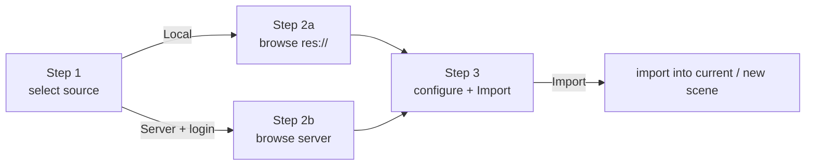

# Import Manager (editor UI)

The import manager is the editor-only GDScript UI a user drives to bring a USD file
into the scene. It lives under `addons/IDTXFlow/import_manager/` (plus the plugin
entry in `addons/IDTXFlow/`). It contains no networking itself: it reaches the
native binding only through the `IdtxClient` engine singleton (see
[godot-binding.md](godot-binding.md)).

Two import sources are supported, both driven by the same 3-step wizard:

- **Local (res://)** — pick a USD file from the project and import it. No backend.
- **Asset server** — log in to an IDTX server, browse its files, and import a USD
  via authenticated download; optionally as a live collaboration session.

| Path | Contents |
|---|---|
| `plugin.gd` | `EditorPlugin` entry: main screen + inspector plugin + settings |
| `import_manager/import_manager.gd` | The wizard root (the active main screen) |
| `import_manager/step_*.gd` | The wizard steps |
| `import_manager/*_file_provider.gd`, `file_provider.gd` | Browser data sources |
| `import_manager/wizard_*.gd` | Reusable wizard widgets + theme |
| `import_manager/server_registry.gd`, `idtx_client_access.gd` | Support helpers |

---

## Plugin entry

`plugin.gd` is the `EditorPlugin`. On enter it:

- creates the import-manager main screen and attaches it to the editor's main
  viewport,
- registers the custom Inspector row for `UsdStageNode3D.stage_uri` (the "Connect"
  reload button),
- configures the ProjectSettings used to persist server URLs and usernames.

The active main screen is **`import_manager.gd`** (referenced by `plugin.gd` as its
`MainScreenScript`). The native `IdtxClient` singleton is created and registered
from C++ at module init and its `poll()` is driven by the frame ticker, so no
GDScript autoload hosts it.

---

## The import wizard (`import_manager.gd`)

The wizard is a `PanelContainer` that fills its editor tab. It holds the shared
`_import_state` (source, selected path/metadata, destination), swaps step controls
in a step container via `_show_step(n)`, and owns no session state itself — the
collaboration session lifecycle is owned by the engine.

The three live steps:

- **Step 1 — `step_select_source`** — choose *Import USD from local files* (goes
  straight to the local browser), or enter an *Asset Server* URL and click
  *Connect* to reveal an inline login panel; a successful login advances to the
  server browser.
- **Step 2a — `step_browse_files`** — browse `res://` for USD files. A thin wrapper
  around a `WizardHeader` + a `WizardFileBrowser` driven by a `LocalFileProvider` +
  a `WizardFooter`.
- **Step 2b — `step_browse_server`** — the same layout, but the `WizardFileBrowser`
  is driven by a `ServerFileProvider` that lists the backend's files.
- **Step 3 — `step_configure`** — merged import-options screen: destination
  (import into the *current* scene, or create a *new* scene with the stage as
  root), settings, and an asset preview. For a server import, an *Import as
  collaboration session* option opts into a live session (single or collaborative
  mode). The **Import** button triggers the import.

---

## Providers (the browser data sources)

`WizardFileBrowser` is source-agnostic: it never touches `DirAccess`/`FileAccess`
or the backend directly. It asks a *provider* to list a directory and renders the
entries. The provider contract is `file_provider.gd`.

- **`LocalFileProvider`** — wraps `DirAccess`/`FileAccess` and mirrors
  `FileDialog`'s access model (`res://` / `user://` / OS filesystem). Listing is
  synchronous.
- **`ServerFileProvider`** — talks to the IDTX backend through the `IdtxClient`
  singleton (`GET /api/v1/files`). The backend returns one **flat, recursive**
  listing of every USD file (each with `filepath` + `directory`); the provider
  synthesizes a browsable directory tree from that single response, caches it, and
  reloads when the server URL changes.

---

## Reusable widgets

- **`WizardFileBrowser`** — an embeddable file browser that ports the *interior* of
  Godot's `FileDialog` into a plain `VBoxContainer` (since `FileDialog` is a
  `Window` and can't be embedded), reusing the editor theme's icons. For
  thumbnail-capable providers it also requests a thumbnail per file row and caches
  the decoded textures.
- **`WizardHeader`** — the progress line ("Step N of M — …") plus a thin progress
  bar.
- **`WizardFooter`** — the button row: `[ Back ] … [ Cancel ] [ Primary ]`.
- **`AssetDetailPanel`** — shows the selected asset's larger thumbnail preview (via
  `IdtxClient.fetch_thumbnail`) and metadata. See [flows.md](flows.md) for the full
  thumbnail request/cache behavior.
- **`wizard_theme`** — a small helper that adapts the wizard to the editor theme
  and UI scale.

---

## Support helpers

- **`ServerRegistry`** — persists known asset servers and the usernames saved for
  each, in ProjectSettings (`idtxflow/import/servers`, `idtxflow/import/last_server`),
  registered by `plugin.gd`.
- **`IdtxAccess`** (`idtx_client_access.gd`) — a stateless lookup for the native
  `IdtxClient` engine singleton, so UI scripts share one call site instead of each
  resolving the singleton themselves. It creates and owns nothing.

---

## UI import flows

The wizard drives three flows; the end-to-end detail (including the backend and
transform sync) is in [flows.md](flows.md).

- **Local import** — the selected `res://` USD is imported into the current scene
  (`_perform_import_into_current_scene`) or a new scene
  (`_perform_import_into_new_scene`). No backend.
- **Server download import** — after login + selection, the stage is fetched via an
  authenticated download and loaded, like the local import but from the server.
- **Server collaboration import** — `IdtxClient.begin_server_import(usd_file, mode)`
  runs the create → open-socket sequence in the engine; the wizard listens for the
  `session_ready` signal, loads the stage from the resolved download URL, and calls
  `attach_transform_sync(stage_node, true)` so the loaded stage broadcasts and
  applies live edits. Both the current-scene and new-scene destinations are
  supported (the new-scene path packs and reopens the stage as its own scene, then
  re-attaches sync to the reopened stage node).

The session lifecycle is owned by the engine (`begin_server_import` / `end_session`),
not the wizard, so the wizard tracks no session state.

