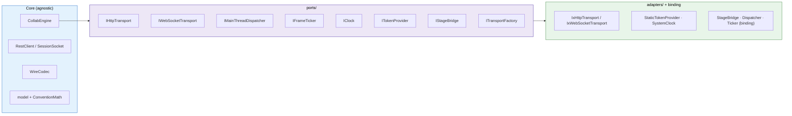

# Net Core (engine-agnostic)

The net core is the networking, protocol, and domain layer of the collaboration
client. It lives entirely under `shared/idtxflow/net/` and is **engine-agnostic**:
it names no Godot type and no specific HTTP/WebSocket library. It talks to the
outside world only through *ports* (interfaces it requires) and reports every
result back through a single *observer*. Any host engine reuses this core
unchanged and provides only the engine-specific adapters.

See [overview.md](overview.md) for the whole-system overview, and
[transform-sync-flow.md](transform-sync-flow.md) for the inbound/outbound
transform-sync flows that build on this core.

---

## Directory map

| Path | Contents |
|---|---|
| `net/CollabEngine.{h,cpp}` | The orchestrator: state, gating, REST + session flow, `poll()` |
| `net/CollabObserver.h` | The single result sink the host implements |
| `net/CollabComposition.h` | Helpers that assemble the engine-agnostic ports |
| `net/protocol/` | `RestClient`, `SessionSocket` — request/session logic |
| `net/wire/WireCodec.{h,cpp}` | protobuf <-> model translation (the only protobuf boundary) |
| `net/model/` | `Types`, `ConventionMath`, `SessionState`, `CloseReason` — plain data + matrix math |
| `net/ports/` | The 8 interfaces the core requires |
| `net/adapters/` | Concrete, engine-agnostic implementations (IX transport, token, clock, REST codec) |

---

## Architectural layers (ports & adapters)

`CollabEngine` is the core; it depends only on the port interfaces and reports
through one `CollabObserver`. Concrete adapters implement the ports. The core
never sees an engine type, a WebSocket library, or OpenUSD.

| Layer | Files | Role |
|---|---|---|
| Core | `CollabEngine.cpp` | Orchestration, broadcast gate, session flow, arming, `poll()` |
| Protocol | `protocol/RestClient.cpp`, `protocol/SessionSocket.cpp` | REST orchestration; session WebSocket immediate send + dispatch |
| Wire | `wire/WireCodec.cpp` | protobuf <-> model (the only protobuf code) |
| Model + math | `model/Types.h`, `model/ConventionMath.h` | Plain data; wire<->USD matrix transpose |
| Ports | `ports/*.h` | The interfaces the core requires |
| Adapters | `adapters/**` | Concrete port implementations (IX transport, token, clock, REST codec) |



**Threading.** Transport callbacks (HTTP completions, inbound WebSocket frames)
arrive on a **network thread**. `CollabEngine` marshals every one of them onto
the host's **main thread** through `IMainThreadDispatcher::post` before touching
the stage or calling the observer — so an observer implementation may safely touch
engine objects. The once-per-frame `poll()` is driven by `IFrameTicker`; it
advances the outbound-arming settle countdown (outbound edits are sent immediately
in `on_stage_changed`, not flushed here).

---

## CollabEngine

The orchestrator. It owns the protocol objects, holds the session/auth/sync
state, and decides when a local edit is broadcast. Construction is cheap; real
setup is `initialize(ports, observer)` and teardown is `shutdown()` (both
idempotent).

Its public surface, by area:

- **Config / auth** — `set_base_url`, `base_url`, `ws_base_url`, `download_url`,
  `is_authenticated`, `clear_credentials`.
- **REST operations** (results delivered to the observer) — `login`, `health`,
  `fetch_thumbnail`, `list_files`, `create_session`, `delete_session`,
  `list_sessions`, `get_session`, `commit_session`, `check_download_exists`,
  `check_thumbnail_exists`.
- **High-level session flow** — two entry points share one tail. `open_new_session(usd_file, mode, auto_commit)`
  creates a session (`POST /sessions` with body `{ usd_file, mode, auto_commit }`; `auto_commit`
  asks the server to commit overrides back to the file on teardown); `open_existing_session(session_id)` joins an existing one
  (`GET /sessions/<id>`). Both then run the private `enter_session(SessionInfo)`: own the active
  session id/mode, resolve the authenticated stage download URL and the full socket URL, open the
  socket, then report `on_session_ready` so the host loads the stage and attaches it back. (`download_url`
  only *composes* the URL — the JWT-authenticated fetch happens later in the USD http asset resolver.)
  `end_session()` tears the active session down (detach stage, close socket, request backend deletion)
  and reports `on_session_closed`.
- **Session socket** — `open_session_socket`, `close_session_socket`,
  `is_socket_open`.
- **Transform sync** — `attach_stage(stage, remote)` / `detach_stage`,
  `arm_sync`, and `poll()`. The stage bridge is owned by the host node and borrowed
  here (`attach_stage` installs the engine's change sink on it); authoring is driven
  node-side (see [stage-authoring.md](stage-authoring.md)). Broadcasting is gated:
  `on_stage_changed` sends immediately, only when the session is *remote*, *armed*,
  *snapshot-complete*, its socket is *open*, and it is not currently *applying a
  remote edit* (loopback suppression); otherwise the edit is dropped. Arming requires
  two gates: a short post-attach settle (so USD conversion-time writes do not
  phantom-broadcast) **and** the join snapshot completing (`SnapshotComplete`) — the
  protocol forbids sending before the snapshot. A reconnect re-gates on the snapshot
  only (the session disarms and clears `snapshot_complete`); the settle latch stays
  set, since a reconnect does not reconvert the stage.

The adapters the engine needs are passed in one struct:

```cpp
struct CollabPorts {
    ports::IHttpTransport*        http;
    ports::IWebSocketTransport*   ws;
    ports::IMainThreadDispatcher* dispatcher;
    ports::ITokenProvider*        token;
    ports::IStageBridge*          stage;   // optional; set later via attach_stage
    ports::IClock*                clock;
    ports::IFrameTicker*          ticker;
};
```

The engine **borrows** these (raw pointers); the composition root owns the
concrete objects.

---

## CollabObserver

The single sink through which the engine reports results. A host implements it
once and turns each callback into engine-native events (e.g. Godot signals).
**Every method is invoked on the host's main thread** (the engine marshals
background results through the dispatcher first).

- **REST results** — `on_login_ok`, `on_health`, `on_thumbnail`, `on_files`,
  `on_session_created`, `on_sessions`, `on_session_details`, `on_session_committed`,
  `on_download_exists`, `on_thumbnail_exists`, `on_request_failed(Op, RestError)`.
- **Session flow** — `on_session_ready(session, stage_url, ws_url)`,
  `on_session_closed(session_id)`.
- **Socket lifecycle** — `on_socket_opened`, `on_handshake`, `on_remote_edit`,
  `on_ack`, `on_socket_error`, `on_disconnected`.

`Op` (`Login`, `ListFiles`, `CreateSession`, `DeleteSession`, `Health`,
`FetchThumbnail`, `ListSessions`, `GetSession`, `CommitSession`, `CheckDownload`,
`CheckThumbnail`) tags a failed REST call so the host can route the error.

---

## The ports

Each port is an interface the core *requires*; a binding provides the concrete
implementation. The core depends only on these.

| Port | The core needs to… | Typical adapter |
|---|---|---|
| `IHttpTransport` | issue HTTP requests (sync + async) | IX HTTP client + a small thread pool |
| `IWebSocketTransport` | send/receive binary frames, observe connection state | IX WebSocket |
| `IMainThreadDispatcher` | marshal a background result onto the host main thread | engine main-thread hop |
| `IFrameTicker` | run `poll()` once per frame | engine per-frame signal |
| `IClock` | monotonic milliseconds to stamp edits | system wall clock |
| `ITokenProvider` | read/set/clear the current bearer token | process-wide holder |
| `IStageBridge` | author/apply/read prim transforms; report stage changes | engine + USD bridge |
| `ITransportFactory` | construct the HTTP / WebSocket transports | picks the concrete transport library |

`IStageBridge` is the transform-sync seam: `author_local_edit` writes the live
stage (the free local save), `apply_remote_edit` applies an inbound edit with
loopback suppression, `read_prim` reads a transform, `set_on_changed` /
`has_on_changed` register and report the sink the bridge fires on stage-originated
changes, and `is_stage_root` identifies the display-only placement root. The bridge
is owned by the host stage node and borrowed by the engine — see
[stage-authoring.md](stage-authoring.md).

`ITokenProvider` is shared by everything that authenticates — REST, the socket
upgrade, and the USD asset fetcher — and is read at use time so login/logout
rotation takes effect without reconfiguring readers.

---

## Protocol layer

- **`protocol/RestClient`** — REST orchestration for the backend: builds
  requests, attaches the bearer token, applies protocol rules (a 401 invalidates
  the stored token), and delivers `model` results through caller callbacks. Owns
  no transport or JSON — it drives an `IHttpTransport` and translates bytes via
  the REST codec. Successful thumbnails are cached in-memory by `usd_file`.
- **`protocol/SessionSocket`** — the session protocol over a WebSocket: inbound
  frame dispatch (handshake / remote edit / ack / error), **immediate outbound
  send** with per-prim duplicate suppression (an edit identical, payload only, to
  the last one sent for that prim is dropped), and disconnect classification. Holds
  no transport or protobuf types. Outbound updates carry two ordering fields:
  - **`server_seq`** — a per-session version counter the server increments once per
    applied stage change. Server messages that reflect state (broadcast, ack,
    `SnapshotComplete`) carry it so clients can order them; an outbound
    `TransformUpdate` carries, as its *base*, the highest `server_seq` the client had
    applied (captured at send time), and the server rejects the update if that base
    is stale.
  - **`request_id`** — chosen by the client per `TransformUpdate` and echoed in the
    matching **Ack**, purely so the client can correlate an ack to its update for
    diagnostics. Acks drive no client action: the client adopts the ack's
    `server_seq` (advancing its own base past its applied edit) and does not resend.
    The server resolves ordering — after a stale/invalid base it sends no correction
    (the newer state is already on its way), and an un-appliable edit draws a server
    *correction* broadcast that re-syncs the client.
  - **On disconnect** — any edit authored while the socket is down is dropped; the
    last-sent cache is cleared. On reconnect the client re-arms after the fresh
    `SnapshotComplete` and the join snapshot is authoritative (the client has no
    knowledge of intervening server state, so replaying local edits ahead of the
    snapshot would diverge from the server).

---

## Backend endpoints

The IDTX backend exposes the API below. The **Client** column marks what this
collaboration client currently uses; the rest are supported by the backend but
not yet driven from here.

| Path | Auth | Methods | Description | Client |
|---|---|---|---|---|
| `/api/v1/auth/login` | No | POST | Authenticate a username/password against the IDP and return a JWT for authenticated endpoints. | ✅ `login` |
| `/api/v1/health` | No | GET | Health check. | ✅ `health` |
| `/api/v1/files` | Yes | GET | List files in the server's uploads folder (JSON). | ✅ `list_files` |
| `/api/v1/download/<path>` | Yes | HEAD | 200 if a valid file exists at `<path>`. | ✅ `check_download_exists` |
| `/api/v1/download/<path>` | Yes | GET | Return the file's contents. | ✅ stage download (JwtHttpFetcher) |
| `/api/v1/upload` | Yes | POST | Upload a USD file (`.usd`, `.usda`, `.usdc`, `.usdz`). | — |
| `/api/v1/thumbnail/<path>` | Yes | HEAD | 200 if a thumbnail exists for the USD file at `<path>`. | ✅ `check_thumbnail_exists` |
| `/api/v1/thumbnail/<path>` | Yes | GET | Return the generated thumbnail (PNG). | ✅ `fetch_thumbnail` |
| `/api/v1/sessions` | Yes | GET | List active multi-user sessions. | ✅ `list_sessions` |
| `/api/v1/sessions` | Yes | POST | Create a session for a USD file (body `{ "usd_file": "scenes/foo.usda" }`). | ✅ `create_session` |
| `/api/v1/sessions/<id>` | Yes | GET | Retrieve details for a session. | ✅ `get_session` |
| `/api/v1/sessions/<id>/commit` | Yes | POST | Commit session changes to the original USD file. | ✅ `commit_session` |
| `/api/v1/sessions/<id>` | Yes | DELETE | Tear down a session and disconnect all clients. | ✅ `delete_session` |
| `/ws?sid=<id>` | Yes | WebSocket | Session socket for real-time edits (protobuf binary frames). | ✅ `SessionSocket` |

The authenticated endpoints take the JWT from `ITokenProvider` as a
`Bearer` header (the WebSocket sends it on the upgrade). Session creation returns
the relative `ws_url`, which the high-level `begin_session` flow resolves against
the base URL to open the socket.


---

## Wire & model

- **`wire/WireCodec`** — the only code that speaks protobuf on the wire. It
  translates the generated `BaseMessage` to/from the plain `model` types; the
  generated protobuf types never leak past this boundary.
- **`model/Types`** — plain data: `Mat4` (row-major 4x4), `SeparateXform`
  (T/R/S, Euler degrees USD convention), `PrimEdit` (one prim's transform edit),
  `FileEntry`, `SessionInfo`, `LoginResult`, `RestError`, `HealthResult`,
  `ThumbnailResult`.
- **`model/ConventionMath`** — the single source of truth for the two matrix
  conventions: the **wire** matrix is row-major (stored verbatim), while the
  **USD** matrix is the wire matrix with its rotation/scale 3x3 block transposed
  (USD uses row-vector math, an engine Basis column-vector); the translation row
  is unchanged. Pure functions, so wire/USD round-trips are testable without a
  live stage.

---

## Adapters (engine-agnostic)

These concrete implementations live in `net/adapters/` and are reusable by any
binding — none of them name an engine.

| Adapter | Port | Notes |
|---|---|---|
| `IxHttpTransport` | `IHttpTransport` | IX HTTP client; async on a bounded thread pool |
| `IxWebSocketTransport` | `IWebSocketTransport` | IX WebSocket; TLS trust, keepalive ping, bounded auto-reconnect |
| `IxTransportFactory` | `ITransportFactory` | the one place that names the IX library |
| `StaticTokenProvider` | `ITokenProvider` | process-wide, thread-safe token holder |
| `SystemClock` | `IClock` | `std::chrono` wall clock |
| `RestCodec` | — | JSON <-> model for the REST path (the only JSON dependency) |
| `JwtHttpFetcher` | — | attaches the current JWT to a download; used by the USD asset resolver |

---

## Composition

Assembling the ports is the composition root's job (one per engine binding). The
engine-agnostic subset is identical for every binding, so it is built once by the
shared helpers in `CollabComposition`:

- `make_agnostic_ports(factory, ports)` — builds the HTTP/WebSocket transports
  from an injected `ITransportFactory` and fills the agnostic port fields
  (`http`, `ws`, `token`, `clock`); returns the owned transports for the caller
  to keep alive.
- `make_jwt_fetcher(factory)` — builds the `JwtHttpFetcher` for the USD asset
  resolver from the same factory + shared token.

`ITransportFactory` is the *which library* seam (`IxTransportFactory` selects IX);
`CollabComposition` is the library-neutral *how to assemble* mechanism (it depends
only on the port, never on IX). The composition root picks the factory.

---

## Portability — what a new host engine reuses vs. implements

A new engine binding reuses the entire net core unchanged and provides only the
adapter side. **Reused verbatim by every engine:** `CollabEngine`,
`CollabObserver`, all `ports/*`, `model/*` (incl. `ConventionMath`),
`wire/WireCodec`, `protocol/RestClient`, `protocol/SessionSocket`, the
`CollabComposition` helpers, `IxTransportFactory`, `IxHttpTransport`,
`IxWebSocketTransport`, `StaticTokenProvider`, and `SystemClock`.

| Piece | Contract | Reference adapter (Godot) | New engine |
|---|---|---|---|
| Client + observer + composition root | implements `CollabObserver`; owns `CollabEngine`; supplies ports | `IdtxClient` | **Implement** (engine object + native events + type marshalling) |
| Stage bridge | `IStageBridge` | `StageBridge` (engine + USD) | **Implement** (read/author USD against the engine scene) |
| Transform codec | built on `ConventionMath` | `TransformCodec` | **Implement** (engine transform type <-> `PrimEdit`/`Mat4`) |
| Main-thread dispatcher | `IMainThreadDispatcher` | `Dispatcher` | **Implement** (engine main-thread hop) |
| Frame ticker | `IFrameTicker` | `Ticker` | **Implement** (engine per-frame source) |
| HTTP transport | `IHttpTransport` | `IxHttpTransport` | **Reuse**, or provide a native one |
| WebSocket transport | `IWebSocketTransport` | `IxWebSocketTransport` | **Reuse**, or provide a native one |
| Transport factory | `ITransportFactory` | `IxTransportFactory` | **Reuse**, or provide one for a native lib |
| Agnostic port composition | — | `CollabComposition` helpers | **Reuse** |
| Clock | `IClock` | `SystemClock` | **Reuse** |
| Token provider | `ITokenProvider` | `StaticTokenProvider` | **Reuse** |
| Registration / boot | — | `register_types.cpp` | **Implement** (engine module/plugin boot) |

So a second engine is that client class plus the genuinely engine-bound adapters
(stage bridge, transform codec, dispatcher, ticker) and its own registration —
the core logic and contracts do not move. The Godot side of that column is
documented in [godot-binding.md](godot-binding.md).

---

## Extending the system

New behavior is added by **extending a port or a codec**, never by editing the
transport or the engine. Four common cases:

- **Add a REST endpoint.** Add the result type to `model/Types.h`, a parser to
  `RestCodec` (JSON stays confined there), a method on `RestClient` that builds the
  request and routes the response, then surface it on `CollabEngine` + `CollabObserver`
  and expose it on the binding as a method + signal/callback. No transport change —
  the HTTP port is method/URL-agnostic. Cover it with a fake-`IHttpTransport` test.

```cpp
// 1. model/Types.h — plain result type (no JSON, no engine types)
struct FooResult { std::string id; };

// 2. RestCodec — the only place the JSON dependency lives
static bool parse_foo(const std::string& body, model::FooResult& out);

// 3. RestClient — declare the method + endpoint, then route the response
using FooCb = std::function<void(const model::FooResult&)>;
void get_foo(FooCb on_ok, ErrorCb on_err);

// RestClient.cpp — the HTTP method + URL path are declared here:
void RestClient::get_foo(FooCb on_ok, ErrorCb on_err) {
    IHttpTransport::Request req;
    req.method   = "GET";
    req.endpoint = "/api/v1/foo";   // composed as base_url + endpoint
    // send via http_ (token attached from token_), then parse with
    // RestCodec::parse_foo and post the result via dispatcher_.
}
```

- **Add a WebSocket / protobuf message.** Declare the message in the wire contract
  under `shared/proto/idtxcore/*.proto` (the build regenerates the protobuf code),
  handle it in `WireCodec` (the generated types stay in that one file), add a callback
  in `SessionSocket` and dispatch the new kind on receipt (drop a duplicate if it is
  high-frequency per-prim, as `send` does), surface it on the engine + observer, and
  expose it on the binding. Cover it with a codec round-trip test and a
  fake-`IWebSocketTransport` dispatch test.

```cpp
// 1. shared/proto/idtxcore/session.proto — declare the wire message
message FooMessage { string prim_path = 1; }

// 2. wire/WireCodec.h — neutral result struct (callers never see the generated type)
struct FooMsg { std::string prim_path; };

// 3. WireCodec — decode the new frame kind into the model struct
static bool decode_foo(const std::string& bytes, wire::FooMsg& out);

// 4. SessionSocket — dispatch it on receipt via a caller-supplied callback
using FooMsgCb = std::function<void(const wire::FooMsg&)>;
void set_on_foo(FooMsgCb cb);
```

- **Add a transport backend** (a non-IX HTTP or WebSocket library): implement
  `IHttpTransport` or `IWebSocketTransport` as a new adapter and wire it via the
  transport factory in the binding's initialize step. The core is untouched.

- **Add a new engine binding** (a non-Godot host): implement the ports and
  `CollabObserver` for that engine, then reuse the entire core unchanged — see
  [Portability](#portability--what-a-new-host-engine-reuses-vs-implements) above.

The through-line: **new behavior is added by extending a port or a codec, not by
editing the transport or the engine.**

