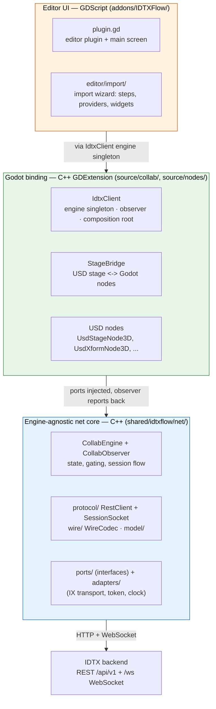
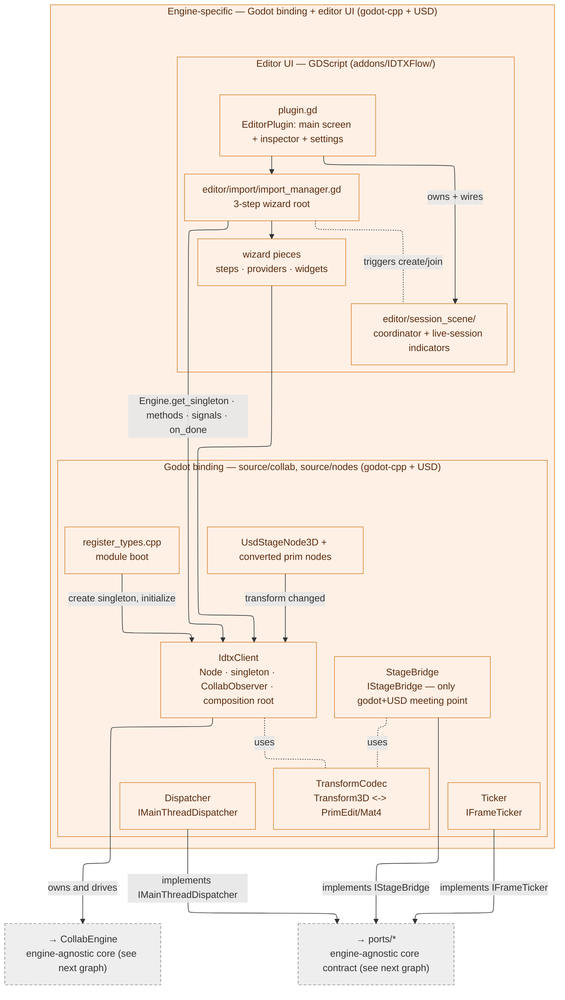
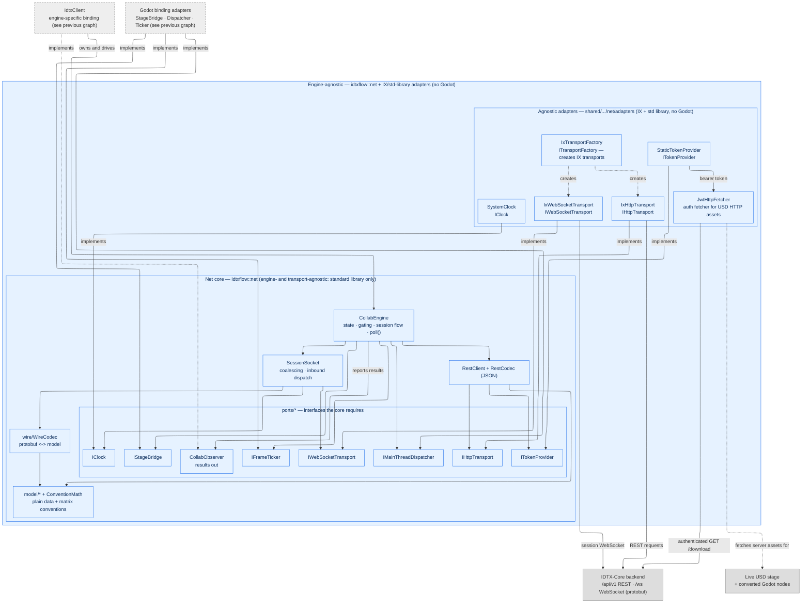

# IDTXFlow Collaboration Client

The collaboration client is the part of IDTXFlow that connects the Godot editor to
an IDTX backend: it authenticates, browses and downloads USD assets from an asset
server, and — for collaboration sessions — opens a live WebSocket and keeps prim
transforms in sync between collaborating peers in real time. Local (res://) imports
share the same import UI but need no backend.

This folder documents that client end to end. Start here, then follow the links
below into each layer.

**Architecture style.** The client is built as a **hexagonal (ports & adapters)**
system: a pure, standard-library-only **core** (`idtxflow::net`) that knows nothing
about Godot, the WebSocket library (IXWebSocket), protobuf-on-the-wire, or OpenUSD.
Everything engine- or library-specific lives in thin **adapters** behind the core's
**ports**. The engine-specific part is the whole **Godot binding** — `source/collab/*`
(`IdtxClient`, `StageBridge`, `TransformCodec`, `Dispatcher`, `Ticker`), the USD nodes
in `source/nodes/*`, and module registration (`register_types.cpp`). Within that
binding, `StageBridge` is the single place Godot and OpenUSD types meet. A different
host engine reuses the entire core and swaps only these adapters — see
[net-core.md](net-core.md) for the ports contract and
[Extending the system](net-core.md#extending-the-system) for how new behavior is added.

---

## The three layers

The client is built as a **hexagonal (ports & adapters)** system split across three
layers, so the networking/protocol logic is engine-agnostic and reusable, and only a
thin layer is specific to Godot.

- **Engine-agnostic net core** — all networking, protocol, and domain logic. Names no
  Godot and no specific HTTP/WebSocket library; talks to the world only through *ports*
  and reports results through a single *observer*. Reusable by any host engine.
- **Godot binding** — the only Godot-specific C++. Implements the engine-specific ports
  (main-thread dispatch, per-frame tick, USD stage bridge), converts between Godot and
  core types, and is the composition root that wires everything together.
- **Editor UI** — the GDScript editor plugin and the import wizard the user drives.

---

## Architecture

### Engine-specific layer — Godot binding + editor UI

**↕ Boundary: `IdtxClient` (engine-specific binding) owns and drives `CollabEngine` (engine-agnostic core), and the binding implements the core's ports. The two graphs meet at this seam. The binding's `StageBridge` is also the one place that authors and reads the live USD stage.**

### Engine-agnostic layer — idtxflow::net core + adapters

---

## Where things live

| Layer | Location | Key pieces |
|---|---|---|
| Net core | `shared/idtxflow/net/` | `CollabEngine`, `CollabObserver`, `protocol/` (RestClient, SessionSocket), `wire/WireCodec`, `model/`, `ports/`, `adapters/`, `CollabComposition` |
| Godot binding | `source/collab/`, `source/nodes/`, `source/register_types.cpp` | `IdtxClient`, `StageBridge`, `TransformCodec`, `Dispatcher`, `Ticker`, USD nodes, module boot |
| Editor UI | `addons/IDTXFlow/` | `plugin.gd`, `editor/import/` (wizard), `editor/session_scene/` (session-scene lifecycle + indicators), `editor/inspector/` |

---

## Documents

- **[net-core.md](net-core.md)** — the engine-agnostic net stack: layers, ports & adapters, threading,
  REST + session protocol, wire codec, model/convention math, composition, and what a new
  host engine reuses vs. implements.
- **[godot-binding.md](godot-binding.md)** — the Godot C++ side: `IdtxClient`, `StageBridge`, `TransformCodec`,
  dispatcher/ticker/clock, USD nodes, module registration, and the USD HTTP asset resolver.
- **[import-manager.md](import-manager.md)** — the editor UI: the plugin/main screen and the import wizard
  (steps, providers, widgets) for local and server imports — plus the editor session-scene coordinator,
  transient session scenes, and live-session indicators.
- **[flows.md](flows.md)** — end-to-end user flows (local import, server download, create/join collaboration
  session) and the session lifecycle.
- **[transform-sync-flow.md](transform-sync-flow.md)** — deep dive on how a single transform
  edit travels inbound and outbound between the editor and collaborating peers.

---

## Supported flows at a glance

- **Local import** — pick a USD file from `res://` and import it into the current or a new scene. No backend.
- **Server download import** — log in to an asset server, browse its files, and import a USD via an authenticated download (into the current or a new scene). No session.
- **Create collaboration session** — as above, but open a live session for the file (single-edit or collaborative-edit): a WebSocket is opened and the stage is wired for real-time transform sync with other peers.
- **Join collaboration session** — join a running collaborative-edit session for the selected file; same live transform sync.
