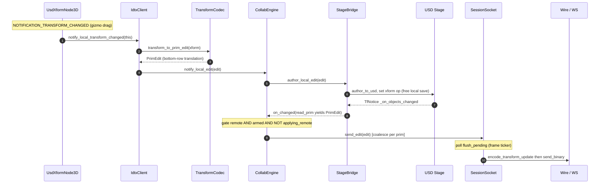
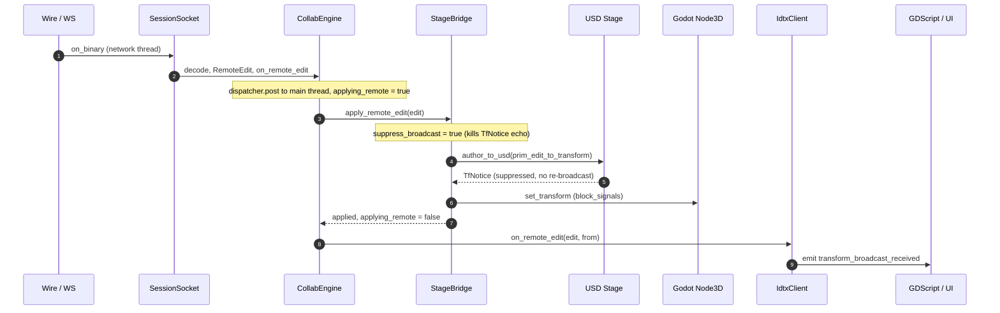

# Transform Sync — Inbound & Outbound Flows

How a transform edit travels between the Godot editor and collaborating peers in
the IDTXFlow real-time client.

---

The layers this builds on — the engine-agnostic core, its ports & adapters, the
threading model, and what a new host engine reuses vs. implements — are described in
[net-core.md](net-core.md) and [godot-binding.md](godot-binding.md). This document
focuses on how a single transform edit travels **outbound** (a local gizmo drag ->
peers) and **inbound** (a peer edit -> my stage + UI).

---


## Outbound — local gizmo drag to broadcast



**Key points**
- **Author into USD first.** notify_local_edit then author_local_edit writes the
  live stage, which *is* the free local save. The USD TfNotice is the single
  "stage changed" source, so editor gizmo edits and script edits broadcast
  through the exact same gate.
- **The broadcast gate** (CollabEngine::on_stage_changed) sends only when
  remote_ AND armed_ AND NOT applying_remote_.
- **Arming.** attach_stage(remote=true) sets arm_countdown_ = kArmAfterTicks
  (3 frames); poll() counts down so USD load-time transform writes settle
  before broadcasting (otherwise they would phantom-broadcast).
- **Coalescing.** SessionSocket::send_edit keeps the latest edit per prim;
  poll()/flush_pending emits one frame per prim per tick.

---

## Inbound — peer edit to my stage + UI



**Key points**
- **Thread hop.** Socket callbacks arrive on the transport network thread;
  CollabEngine::open_session_socket's on_remote_edit lambda does
  ports_.dispatcher->post(...) so the apply + observer notification run on the
  Godot main thread.
- **Triple echo prevention** (all three are needed):
  1. applying_remote_ (engine) — on_stage_changed refuses to broadcast while
     a remote edit is being applied.
  2. suppress_broadcast_ (bridge) — the author_to_usd trips a TfNotice, but
     the listener is suppressed so it does not re-send the peer edit.
  3. set_block_signals(true/false) around set_transform — moving the node
     does not fire its NOTIFICATION_TRANSFORM_CHANGED (the outbound path).
- **Stage stays authoritative.** The edit is authored into USD, then the Godot
  Node3D is set to match. The transform_broadcast_received signal is
  informational for UI only — the stage and node already moved in
  apply_remote_edit.

---

## Detailed step-by-step (annotated)

### OUTBOUND — a local gizmo drag → broadcast to peers

```text
User drags gizmo on a UsdXformNode3D (or UsdMeshInstanceNode3D)
        │  Godot fires NOTIFICATION_TRANSFORM_CHANGED
        ▼
[1] source/nodes/UsdXFormNode3D.cpp :: _notification()          (adapter — node)
        │   IdtxClient::get_singleton()->notify_local_transform_changed(this)
        ▼
[2] source/collab/IdtxClient.cpp :: notify_local_transform_changed()   (adapter)
        │   • reads prim_path (IUsdNode3D::get_prim_path); empty → ignored
        │   • n3d->get_transform()  → PrimEdit via
        │     gxform::transform_to_prim_edit()   ── TransformCodec ──▶ ConventionMath::wire_from_basis_origin
        │   engine_.notify_local_edit(edit)
        ▼
[3] shared/.../CollabEngine.cpp :: notify_local_edit()          (agnostic core)
        │   ports_.stage->author_local_edit(edit)     ← writes the LOCAL SAVE first
        ▼
[4] source/collab/StageBridge.cpp :: author_local_edit()   (adapter, Godot+pxr)
        │   (not suppressed) → author_to_usd(prim_path,
        │        gxform::prim_edit_to_transform(edit))
        │        └─ transform_to_gfmatrix → ConventionMath::usd_from_wire → pxr::GfMatrix4d
        │   Sets the USD xform op on the live stage  →  trips a USD TfNotice
        ▼
[5] StageBridge :: _on_objects_changed()  (TfNotice listener)
        │   suppress_broadcast_? no.  For a tracked prim → read_prim()
        │        └─ read_prim_transform + gxform::transform_to_prim_edit → PrimEdit
        │   on_changed_(edit)   ← the sink CollabEngine installed in attach_stage
        ▼
[6] CollabEngine.cpp :: on_stage_changed()      (THE GATE)
        │   broadcast only if  remote_ && armed_ && !applying_remote_
        │   socket_->send_edit(edit)
        ▼
[7] shared/.../SessionSocket.cpp :: send_edit()   (agnostic)
        │   pending_[edit.prim_path] = edit     ← COALESCE: latest-per-prim wins
        ⋮   (per frame)
[8] IFrameTicker → CollabEngine::poll() → SessionSocket::poll() → flush_pending()
        │   stamps timestamp (IClock::now_millis), then for each pending prim:
        │   ws_->send_binary( wire::encode_transform_update(session_id, edit) )
        ▼
[9] shared/.../wire/WireCodec.cpp :: encode_transform_update()   (protobuf, agnostic)
        ▼
[10] IWebSocketTransport::send_binary → IxWebSocketTransport → server → peers
```

### INBOUND — a peer edit → applied to my stage + surfaced to UI

```text
Server pushes a binary frame on the WebSocket
        ▼
[1] IxWebSocketTransport (network thread) → set_on_binary
        ▼
[2] shared/.../SessionSocket.cpp :: handle_binary()          (agnostic)
        │   wire::decode(bytes) → DecodedMessage
        │   Kind::RemoteEdit → on_remote_edit_(edit, from_client_id)
        ▼
[3] shared/.../wire/WireCodec.cpp :: decode()                    (protobuf, agnostic)
        ▼
[4] CollabEngine.cpp :: open_session_socket() lambda  (socket_->on_remote_edit)
        │   ports_.dispatcher->post(...)   ← HOP TO MAIN THREAD (Dispatcher)
        │     on main thread:
        │       applying_remote_ = true;               ← LOOPBACK SUPPRESSION (engine side)
        │       ports_.stage->apply_remote_edit(edit);
        │       applying_remote_ = false;
        │       observer_->on_remote_edit(edit, from)   ← notify UI
        ▼
[5a] source/collab/StageBridge.cpp :: apply_remote_edit()   (adapter, Godot+pxr)
        │   suppress_broadcast_ = true;                ← LOOPBACK SUPPRESSION (bridge/TfNotice side)
        │   xform = gxform::prim_edit_to_transform(edit)   ── TransformCodec
        │   author_to_usd(prim_path, xform)            ← write into USD (keeps stage authoritative)
        │   resolve ObjectID → live Node3D:
        │       node->set_block_signals(true);
        │       node->set_transform(xform);            ← move the actual Godot node
        │       node->set_block_signals(false);
        │   suppress_broadcast_ = false;
        │
        │   (the author_to_usd here fires a TfNotice → _on_objects_changed,
        │    but suppress_broadcast_==true so it does NOT re-broadcast — the echo is killed)
        ▼
[5b] source/collab/IdtxClient.cpp :: on_remote_edit()   (adapter — CollabObserver)
        │   prim_edit_to_transform(edit) via gxform  → Godot Transform3D
        │   emit_signal("transform_broadcast_received", prim_path, xform, from)
        ▼
[6] GDScript / UI listeners react (purely informational; the stage+node already moved in 5a)
```

---

**Spine-axis rotation.** For Cone/Cylinder the loader (UsdGodotTypeConverter::toTransform)
bakes a presentation rotation into the Godot node basis for a non-default axis (X or Z),
because Godot's primitive meshes are Y-spined. The collaboration path inverts that bake so USD
stays raw: StageBridge::spine_axis_for(prim_path) reads the axis from the live stage
(IsA<UsdGeomCone|UsdGeomCylinder> then GetAxisAttr, else None), author_to_usd strips it via
xform::strip_spine_axis before writing (so both the outbound author and the inbound apply store
the raw orientation), and apply_remote_edit re-applies it via xform::apply_spine_axis for
the node set_transform. read_prim_transform (the broadcast read) stays raw. The apply/strip
convention is byte-identical to toTransform (X->rot_z(+90), Z->rot_x(+90), Y/None->identity). Scope
is Cone/Cylinder only, because those are the only prim types the converter bakes a rotation for;
the mechanism is a no-op (None) for every other type, and Capsule has no visual converter in either
direction yet.
